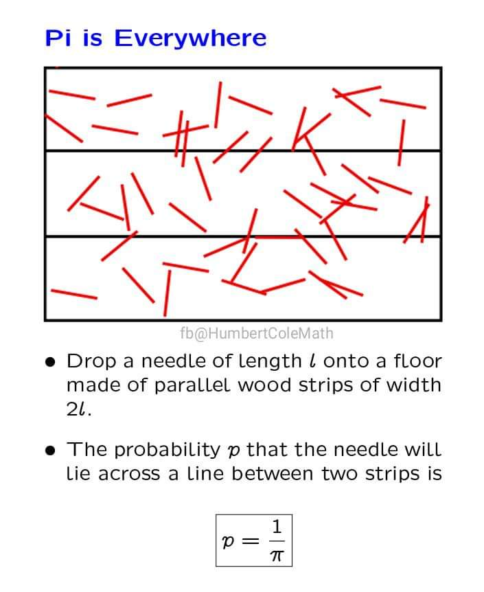
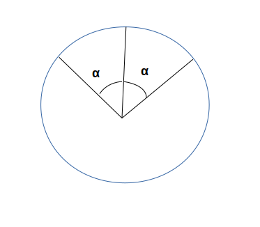

# Problem 1 : An Interesting Problem on Probability

Well, I have a nice picture which states the statement of the problem.

## Solution :

The very first thing that should strike one's mind is that the value of this probability does not depend on the number of the horizontal lines. Or in other words, the problem configuration can be thought of as being infinite in the vertical direction.

Considering this we can wrap these inifinite vertical strips by realizing the periodicity and just consider one set of two parallel horizontal lines $$w$$ with 2 needles of length $$l$$ effectively giving us a rectangle with dimensions $$2l$$ x $$w$$ 

A wrapping of a rectangle about an axis parallel to its width ($$w$$) would be a cylinder with radius $$ 2l/\pi $$. (We're basically, rolling a $$2l$$ x $$w$$ rectange to form a cylinder with circumference $$2l$$ and height $$w$$).
<figure>

<figcaption> A visual representation of the rolling </figcaption>
</figure>
Finally, consider the position of each needle of lenght $$ l $$ to be fully specified if we know the coordinates of its vertical distance of its center from a horizontal line ($$ d $$) and the angle it makes with the horizontal ($$ \theta $$). We can quickly note that the condition that a dropped needle cuts a horizontal line can be mathematically written as :

$$ \lvert d \rvert <= l.sin(\theta)/2 $$

Now, we have all the ingredients to convert his into an equivalent periodic problem. To do this, consider the projection of the cylinder on the plane perpendicular to its axis. This would yield a circle with the same circumference $$ 2l $$ as the vertical needle of length $$ 2l $$ was rolled to give a cylinder. The center of every needle dropped on the surface at a distance $$ d $$ from the horizontal line can be mapped to a point on this circular projection.

For a given angle $$\theta$$ of inclination of the needle, the projection center (at a perpendicular distance $$ \pm $$ d) {on either sides of the horizontal line} can be considered to lie within a $$ [\alpha, -\alpha] $$ angle range where the angle bisector of the full angle $$ 2*\alpha $$ cuts the circle at the point which is the projection of the horizontal line.
<figure>

<figcaption>The circular projection of the cylinder with a sector of angle $$ 2\alpha $$</figcaption>

</figure>

Noting that the arc made by of the sector of angle $$ 2\alpha $$ would be $$ 2d $$ we can easily work out the math to obtain the expression of alpha as 

$$ \alpha = d/R = d/(2l/(2\pi)) = 2\pi.d/l <= \pi.sin(\theta)/2 $$ (We have used the condition for a needle to cut a horizontal line)

But, for a given $$ \theta $$, $$ 2\alpha $$ could have any value from $$ 0 $$ to $$ 2\pi $$ depending on $$ d $$. So, the probability $$ P(Hit | angle=\theta) = (2\alpha)/(2*\pi) = sin(\theta)/2 $$. 

Again, $$ \theta/(\pi) $$ can be any random value from $$ 0 $$ to $$ 1 $$. So, the probability density function $$ P(angle = \theta) = uniform distribution = 1/\pi $$ 

Now we happily integrate :

$$ P(Hit) = \int_{0}^{\pi} sin(\theta)/(2\pi) d\theta = 1/\pi $$

Voila! We're done!

Thanks for reading!

Note- As $$ \theta $$ is the angle with horizontal it only makes sense to consider it in range $$ [0,\pi] $$.
Note 2- [PBC](https://en.wikipedia.org/wiki/Periodic_boundary_conditions) Read more about periodic boundaries.

