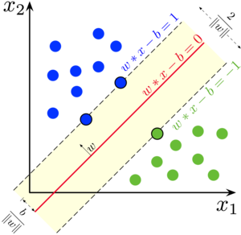

# Problem 2 : A problem on Linear Classification

So, we come back to another interesting problem involving some interesting geometry and calculus. This is the famous Support Vector Machine Classifier. While there are many pretty explanations of the math behind the SVM, I'd like to add my two cents. The problem in its simplest form is best defined as finding a "dividing line" between two kinds of points.

## Why SVM?

This is simply answered by considering the issue with the general regression setting where we could define a set of parameters $\beta$ which map the input vectors (in the figure $((x1,x2))$) to obtain a classification $f(x) = \beta^T.X $. A quick glance and it becomes obvious that we don't want to deal with high-dimensional data which could quickly get messy.

## So what do we do?

We quickly set forth a goal of obtaining a dividing line. This will be a much faster implementation that will quickly give us the parameters relevant to our line. So, the usual notion from our high school mathematics says a line in 2-D is : $$ y = m.x + c $$ or equivalently, $$ ax + by + c = 0 $$ for some a, b and c.

Extending this to a plane, a plane in 3-D is : $$ ax + by + cz + d = 0 $$ for some a, b, c and d.

And extending this further, using a vector of the coefficients and denoting this as $$ w $$ we get, $$ \mathbf{w^T.X + b = 0} $$ where, we have separately kept the intercept vector $$\mathbf{b}$$. [This is known as a Hyperplane]

Next, we define two Hyperplanes parallel (why?) to this hyperplane namely : $$\mathbf{w^T.X + b = 1}$$ and $$\mathbf{w^T.X + b = -1}$$ the sign of the RHS term essentially means the hyperplanes on the two sides of the hyperplane $$\mathbf{w^T.X + b = 0}$$. The gap between the two hyperplanes on either sides of the hyperplane in the middle is basically the "street width" (you can see it in the 2-D Figure).

Let us label the blue points as 1 and the green ones as -1. And, let us give this label a name : $$ y_i $$ for ith point on the plane. So we want the ends of the "street" to be such that :
$$  w^T.X_i + b >= 1 $$ when $$ y_i = 1  $$ and
$$  w^T.X_i + b <=-1 $$ when $$ y_i = -1 $$ or, in general,
$$  y_i.(w^T.X_i + b) >= 1 $$ for all $$ y_i $$

The term on the left hand side is some sort of a metric which says if the point is well-classified or not. If the inequality is satisfied for all points then we have found one possible hyperplane. But, which hyperplane is the best ? That would obviously be decided by the extent of separation between the data-points.

So, we want the LHS of the last inequality to be as large as possible! In order to ensure that the magnitude of the vector $$ w $$ does not change our metric (it only depends on the direction). The obvious thing is to normalize it i.e.

$$ F_i = y_i.(\frac{w^T.X_i}{\|w\|} + \frac{b}{\|w\|}) $$ where $$ \| w \| $$ is the magnitude.

We need to maximise $$ \min_{x_1,\dots x_m} F_i $$ under the constraint that $$ F_i >= \frac{1}{\| w \|} $$.

Quickly noting that the $$  \min_{x_1,\dots x_m} F_i = \frac{1}{\| w \|} $$, our problem transforms into maximising $$ \frac{1}{\| w \|}  $$ or minimising $$ \| w \| $$ under the constraint that $$ F_i >= 1 $$.

We have something to maximise/minimise under constraints so we're obviously going to see Lagrange Multipliers (LM). Let $ F(w) = \frac{1}{2}.(\| w \|)^2 $$ and $$ G_i(w,b) = y_i.(w^T.X_i + b) - 1 $$ we note that our problem is to minimise $$ F $$ under $$ G_i >= 0 $$.

 Now we'll convert it into a dual problem,

[Duality] (https://en.wikipedia.org/wiki/Wolfe_duality) [Just play with it for few minutes and you'll hopefully get it.]

The Lagrange Function becomes : $$  \mathcal{L} = F - \sum{i=1}^{m} \alpha_i.G_i $$. The derivatives of the Langrange Function are:

$$ \nabla_w \mathcal{L} = w - \sum{i=1}^{m} \alpha_i.y_i.x_i = 0 $$
$$ \nabla_b \mathcal{L} = - \sum{i=1}^{m} \alpha_i.y_i  = 0 $$

Putting $$ w = \sum{i=1}^{m} \alpha_i.y_i.x_i $$ and $$ \sum{i=1}^{m} \alpha_i.y_i  = 0 $$ gives use the Wolfe Dual Problem to maximise the expression :

$$ \sum{i=1}^{m} \alpha_i - \frac{1}{2}.\sum{i=1}^{m} \sum{j=1}{m} \alpha_i.\alpha_j.y_i.y_j.(\mathbf{x_i}.\math_bf{x_j}) $$

under the constraint :

$$ \sum{i=1}^{m} \alpha_i.y_i = 0 $$

Woah! We have the final expression for obtaining the $$ \alpha_i's $$ and subsquently obtain the $$ w's $$. 
