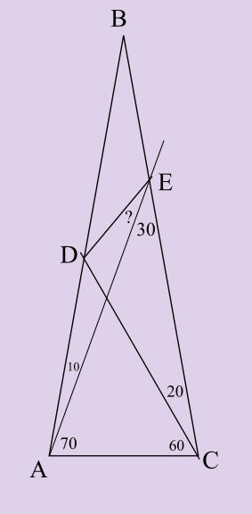
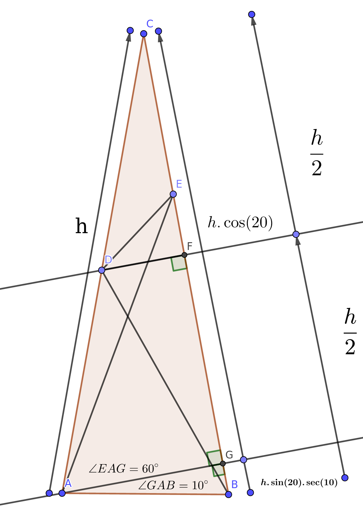

# Problem 4 : A Problem in Triangle Goemetry

This is one of those problem's that's close to my heart. I had encountered a similar problem during my High School days. This problem involving a triangle seemed simple at first (very similar to an old sibling-problem) and that's just what caught me in a loop of attempts. Finally, I was able to come up with a very different approach The good thing about goemetry problems is that they are can be visualized. The triangle ABC is an isosceles triangle with base angle of $$ 80^{\circ} $$. We need to find the angle denoted by a "?".

# A Good Look followed by some Construction

Well, so we need to notice a few things here. First, the apex angle of the triangle is $$ 20 ^{\circ} $$  which automatically makes the  $$ \Delta CDB $$ an isosceles triangle. So, we want to make sure we use that property. Also, not that the base angle EAB $$ = 70^{\circ} $$ which means we can split it into $$ 60^{\circ} + 10 ^{\circ} $$ and $$ 10^{\circ} $$ compliments the base angles $$ 80^{\circ} $$. So, let us go ahead and draw a right angled $$ \Delta AGB $$. Everything is constructed below (Sorry for the absence of padding).

# The Solution 

The solutions is pretty straightforward from here. We label the length $$ AC = CB = h $$. Clearly, DF is the perpendicular of the isosceles $$ \Delta CDB $$ it will bisect $$ CB $$. This implies that $$ CF = FB = \frac{h}{2} $$. It is easy to note from the $$ \Delta CAG $$ that $$ AG = h.sin(20) $$ so, $$ EG = h.sin(20).tan(60) $$. Finally, from the right $$ \Delta CDF $$, $$ DF = \frac{h.tan(20)}{2} $$. This means, $$ EF = CF - (CG - EG) = \frac{h}{2} - (h.cos(20) - h.sin(20).tan(60) $$  

And here we go - In $$ \Delta DEF $$ : $$ tan(\theta + 30) = \frac{DF}{EF} = \frac{tan(20)}{h-2(h.cos(20) - h.sin(20).\sqrt{3} } $$ now go ahead and solve for theta using trigonometric identities (or a calculator).  

Hint : Use $$ cos(3\theta) = 4.cos(\theta)^3 - 3.cos(\theta) $$
