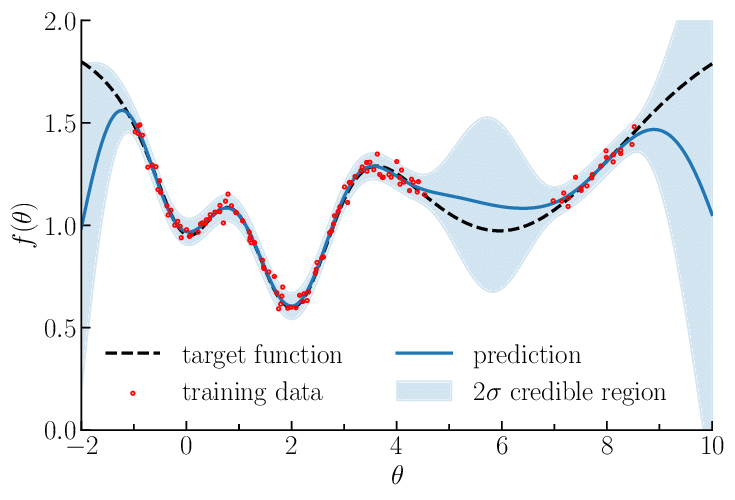

# Problem 6 : Condtional Distribution for Multivariate Gaussians

I started getting interested about the possibilities opened up by incorporating Bayesian models into the machine learning. My room mate during the Globalink Internship program was working on Generative Adversarial Networks (GANs) which often makes use of the math along these lines. The interested me couldn't wait to jump into the topic of Gaussian Process Regression (GPR). I got caught off guard by a theorem that directly gave the condition distribution from a join Gaussian distribution over multiple variables.

# Problem Statement

Let us say that $$ \boldsymbol{Y} $$ is a vector of random variables such that  $$ \boldsymbol{Y} \sim \mathcal{N}(\boldsymbol{\mu}, \Sigma) $$ and we partition $$ \boldsymbol{Y} $$ into
$$ \boldsymbol{y1} $$ and $$ \boldsymbol{y2} $$. Then, $$ \boldsymbol{y1} $$, $$ \boldsymbol{y2} $$ the mean vector and the variance matrix are given by:

$$
\begin{array}{l}
\boldsymbol{\mu}=\left[\begin{array}{l}
\boldsymbol{\mu}_{1} \\
\boldsymbol{\mu}_{2}
\end{array}\right] \\
\boldsymbol{Y}=\left[\begin{array}{l}
\boldsymbol{y}_{1} \\
\boldsymbol{y}_{2}
\end{array}\right]
\end{array}
$$

$$
\left[\begin{array}{ll}
\Sigma_{11} & \Sigma_{12} \\
\Sigma_{21} & \Sigma_{22}
\end{array}\right]
$$

The theorem says that the conditional distribution $$
P(\left(\boldsymbol{y}_{1} \mid \boldsymbol{y}_{2}=\boldsymbol{a}\right))
$$ has the mean vector and covariance matrix given below :

$$
\begin{array}{c}
\overline{\boldsymbol{\mu}}=\boldsymbol{\mu}_{1}+\Sigma_{12} \Sigma_{22}^{-1}\left(\boldsymbol{a}-\boldsymbol{\mu}_{2}\right) \\
\bar{\Sigma}=\Sigma_{11}-\Sigma_{12} \Sigma_{22}{ }^{-1} \Sigma_{21}
\end{array}
$$

# The Proof

The easiest way to prove the theorem turns out to be a clever definition of a new variable say, $$ \boldsymbol{W} = \boldsymbol{y_1} + C\boldsymbol{y_2} $$ where $$ \mathbf{C}=-\Sigma_{12} \Sigma_{22}^{-1}
$$. The reason for the choice of $$ \mathbf{C} $$ will become clear soon.

We can now see that the covariance of $$ \matbf{W} $$ and $$ \mathbf{y}_{2} $$ can be simplified further :

$$
\begin{aligned}
\operatorname{cov}\left(\mathbf{W}, \mathbf{y}_{2}\right) &=\operatorname{cov}\left(\mathbf{y}_{1}, \mathbf{y}_{2}\right)+\operatorname{cov}\left(\mathbf{C} \mathbf{y}_{2}, \mathbf{y}_{2}\right) \\
&=\Sigma_{12}+\mathbf{C} \operatorname{Var}\left(\mathbf{y}_{2}\right) \\
&=\Sigma_{12}-\Sigma_{12} \Sigma_{22}^{-1} \Sigma_{22} \\
&=0
\end{aligned}
$$

This implies that $$ \boldsymbol{W} $$ and $$ \boldsymbol{y2} $$ are uncorrelated. This was possible because of our clever choice of $$ \mathbf{C} $$.

Now, we can write the conditional expectation as

$$
\begin{aligned}
E\left(\mathbf{y}_{1} \mid \mathbf{y}_{2}\right) &=E\left(\mathbf{W}-\mathbf{C} \mathbf{y}_{2} \mid \mathbf{y}_{2}\right) \\
&=E\left(\mathbf{W} \mid \mathbf{y}_{2}\right)-E\left(\mathbf{C} \mathbf{y}_{2} \mid \mathbf{y}_{2}\right) \\
&=E(\mathbf{W})-\mathbf{C} \mathbf{y}_{2} \\
&=\boldsymbol{\mu}_{1}+\mathbf{C}\left(\boldsymbol{\mu}_{2}-\mathbf{x}_{2}\right) \\
&=\boldsymbol{\mu}_{1}+\Sigma_{12} \Sigma_{22}^{-1}\left(\mathbf{x}_{2}-\boldsymbol{\mu}_{2}\right)
\end{aligned}
$$

Also, since $$ \mathbf{W} $$ and $$ \mathbf{y}_{2} $$ are uncorrelated, we may directly write that $$ \operatorname{Var}\left(\mathbf{y}_{1} | \mathbf{y}_{2} \right) $$ is the same as
$$ \operatorname{Var}\left( \mathbf{W} \right) $$.

The variance of $$ \mathbf{W} $$ is given by :

$$
\begin{aligned}
\operatorname{Var}\left(\mathbf{y}_{1} \mid \mathbf{y}_{2}\right)=\operatorname{Var}(\mathbf{W}) &=\operatorname{Var}\left(\mathbf{y}_{1}+\mathbf{C} \mathbf{y}_{2}\right) \\
&=\operatorname{Var}\left(\mathbf{y}_{1}\right)+\mathbf{C} \operatorname{Var}\left(\mathbf{y}_{2}\right) \mathbf{C}^{\prime}+\mathbf{C} \operatorname{cov}\left(\mathbf{y}_{1}, \mathbf{y}_{2}\right)+\operatorname{cov}\left(\mathbf{y}_{2}, \mathbf{y}_{1}\right) C \\
&=\Sigma_{11}+\Sigma_{12} \Sigma_{22}^{-1} \Sigma_{22} \Sigma_{22}^{-1} \Sigma_{21}-2 \Sigma_{12} \Sigma_{22}^{-1} \Sigma_{21} \\
&=\Sigma_{11}+\Sigma_{12} \Sigma_{22}^{-1} \Sigma_{21}-2 \Sigma_{12} \Sigma_{22}^{-1} \Sigma_{21} \\
&=\Sigma_{11}-\Sigma_{12} \Sigma_{22}^{-1} \Sigma_{21}
\end{aligned}
$$

Q.E.D. 
