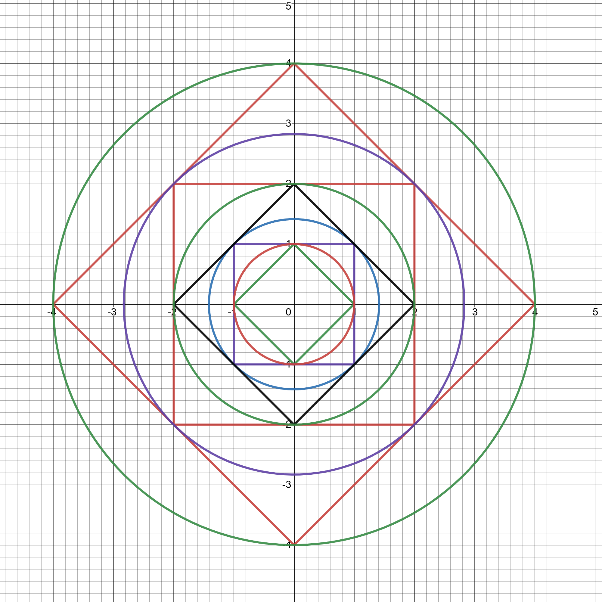

# Problem 7 : Squares formed out of lattice points on circles

This problem was picked up along with my friend. It featured as Problem B1 on the Putnam Competition held in 2019.

Denote by $$\mathbb{Z}^2$$ the set of all points(x,y) in the plane with integer coordinates. For each integer (n ≥ 0), let $$P_n$$ be the subset of $$\mathbb{Z}^2$$ consisting of the point (0,0) together with all points
(x,y) such that $$x^2 + y^2 = 2^k $$ for some integer $$ k≤n $$.   Determine,  as  a  function  of n,  the  number  of four-point subsets of $$P_n$$ whose elements are the vertices of a square.

# Solution

Instead of going by a written proof we provide a proof-without-words which uses the fact that the lattice points lie on a system of concentric circles in addition to the point (0,0) :

A careful look will reveal that the circles represent the equation $$ x^2 + y^2 = 2^k $$ for $$ k < = 4 $$. The system of squares are formed by the lattice points while lie on the circles. The symmetric
nature of the pattern reveals that the number of such squares will be exactly equal to $$ 5n + 1 $$.

Explanation : The first (innermost) square (the one rotated by 45 degrees) adds 1 to the count. Every subsequent square adds 5 to count as the total number of squares also include the smaller squares inside each square.

Try playing with the graph drawn on desmos (Many thanks to the desmos devs!) :
<iframe src="https://www.desmos.com/calculator/2akcyu1zds?embed" width="500px" height="500px" style="border: 1px solid #ccc" frameborder=0></iframe>
