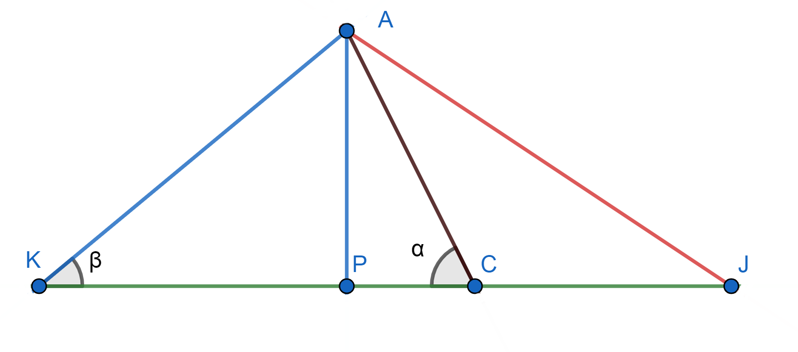
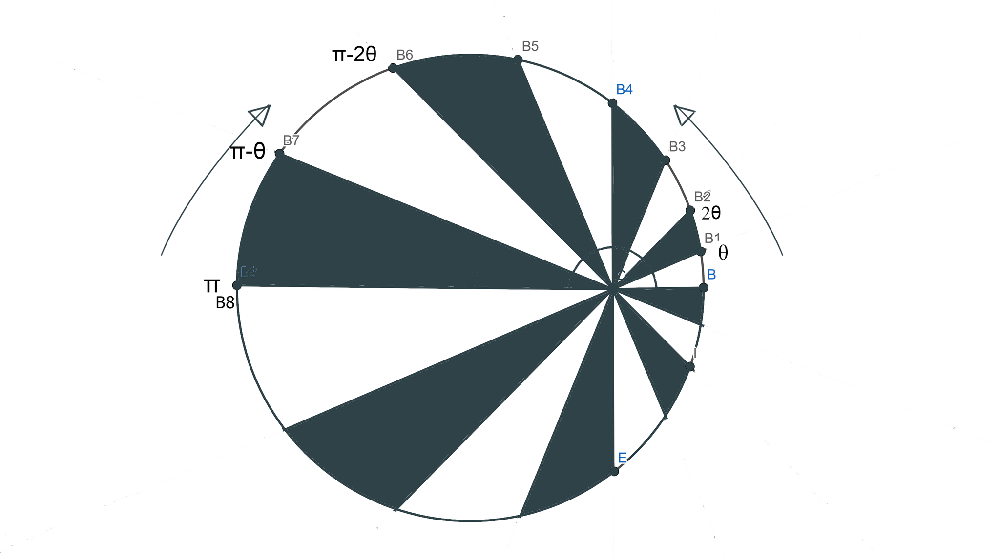

# Problem 8 : A different proof of Pizza Theorem

To all the pizza lovers, this theorem may give you relief that there can't be any unequal divison between you and your friend if you slice a pizza in a certain way. 
Let's say you choose a point other than the center of the pizza(assuming it as a circle) then cut it in $$n$$ slices where $$n$$ is a multiple of 4. The second condition is that all the slices should produce $$2\pi/n$$ radian at your point. Now if you choose alternate pieces the theorem tells that both of you got the same amount of pizza and that is equal to half of the are of the circle.

In the given figure the circle is cut into 8($$n=8$$) sectors and the all of them prodcue $$45^0$$ angle at point C. According to the theorem the area of the white region and the shaded region are same and each equals to half of the total area.

# Solution

To prove this, we use basic idea for finding area between a point a curve line. The formula for that is, 

$$
A= \int_{\theta_1}^{\theta_2} \frac{1}{2} r^2(\theta)\,d\theta 
$$

Let's concentrate of the white region and find out the sector HCD area. The line CJ is an arbitary line between CH and CD producing a variable angle $$\alpha$$ between CB and itself. Now the area of the sector HCD will be,

$$
A_{HCD}=\int_{0}^{\theta_0} \frac{1}{2} \overline{CJ}^2\,d\alpha
$$

Where $$\theta_0$$ is the angle produced by each sector at C(here it's $$45^0$$). Similarly for the sector just opposite to HCD the line CK swipe the complete area as alpha changes from $$0$$ to $$\theta_0$$. So the complete area of HCD and CEG can be expressed as,

$$
A_{HCD+CEG}=\int_{0}^{\theta_0} \frac{1}{2} (\overline{CJ}^2+\overline{CK}^2)\,d\alpha
$$

Now consider the $$\triangle AKJ$$ in dotted line in the figure where the $$\beta=\angle AKJ$$. AP is the perpendicular drawn from A to the line segment JK. Let's take the length of the line segment AC is $$d$$ and the radius of the circle is $$R$$.

From the properties of the $$\triangle AKJ$$, $$\triangle AKP$$, and $$\triangle APC$$ we get,

$$
\overline{PC}=dcos(\alpha) \\
\overline{KP}=Rcos(\beta) \\
\overline{PJ}=Rcos(\beta) 
$$

where $$\triangle AKJ $$is isosceles$$(\angle AKJ= \angle AJK=\beta)$$

Now, sum of the squares of $$\overline{CK}$$ and $$\overline{CJ}$$

$$
\overline{CK}=\overline{CP}+\overline{PK}=Rcos(\beta)+dcos(\alpha) \\
\overline{CJ}=\overline{PJ}-\overline{PC}=Rcos(\beta)-dcos(\alpha) \\
\overline{CK}^2+\overline{CJ}^2=R^2cos^2(\beta)+d^2cos^2(\alpha)
$$

From the diagram $$\overline{AP}=\overline{AC}sin(\alpha)=dsin(\alpha)$$ and $$\overline{AP}=\overline{AK}sin(\beta)=Rsin(\beta)$$. So we get, 

$$
sin(\beta)=\frac{d}{R}sin(\alpha)
$$

Finally we come up the expression,
$$
\overline{CK}^2+\overline{CJ}^2=2(R^2+d^2cos(2\alpha))
$$

Now, the area will be 

$$
A_{HCD+CEG}=\int_{0}^{\theta_0} (R^2+d^2cos(2\alpha))\,d\alpha 
\implies A_{HCD+CEG}= R^2\theta_0+\frac{1}{2}d^2sin(2\theta_0)
$$

Similarly, 

$$
A_{CFL+CBI}= (R^2\theta_0+\frac{1}{2}d^2(sin(6\theta_0)-sin(4\theta_0))
$$

Finally the area of the complete white region is

$$
A_{white}= 2(R^2\theta_0+\frac{1}{2}d^2(sin(6\theta_0)-sin(4\theta_0)+sin(2\theta_0))
$$

Putting $$\theta_0=\pi/4$$

$$
\implies A_{white}= \frac{\pi R^2}{2} \\
\implies A_{shaded}= \frac{\pi R^2}{2}
$$

Now for a $$n$$ cut pizza the area of alternating white regions are sin function of $$\theta_0$$[where $$\theta_0= \pi/n$$]. In the following figure there are total $$\frac{n}{4}$$ terms at the total white area expression and the limit of $$\alpha$$ ends at $$\pi-\theta_0$$ . 

Now let's write down the expressions of area for each white region and it's opposite w.r.t the center. [$$\prime$$ denotes the opposite region of a particular segment]

$$

A_{BB_1+BB\prime_1}=R^2\theta_0+\frac{1}{2}d^2sin(2\theta_0) \\

$$

