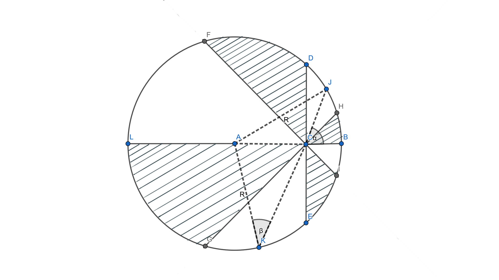

# Problem 8 : A different proof of Pizza Theorem

To all the pizza lovers, this theorem may give you relief that there can't be any unequal divison between you and your friend if you slice a pizza in a certain way. 
Let's say you choose a point other than the center of the pizza(assuming it as a circle) then cut it in n slices where n is a multiple of 4. The second condition is that all the slices should produce $$2\pi/n$$ radian at your point. Now if you choose alternate pieces the theorem tells that both of you got the same amount of pizza and that is equal to half of the are of the circle.

In the given figure the circle is cut into 8(n=8) sectors and the all of them prodcue $$45^0$$ angle at point C. According to the theorem the area of the white region and the shaded region are same and each equals to half of the total area.

# Solution

To prove this, we use basic idea for finding area between a point a curve line. The formula for that is, 

$$
A= [\int_{\theta_1}^{\theta_2} 1/2 r^2(\theta)\,d\theta \]
$$

Let's concentrate of the white region and find out the sector HCD area. The line CJ is an arbitary line between CH and CD producing a variable angle $$\alpha$$ between CB and itself. Now the area of the sector HCD will be,

$$
A_HCD=[\int_{0}^{\theta_0} 1/2 \bar{CJ}^2\,d\alpha \]
$$

Where $$\theta_0$$ is the angle produced by each sector at C(here it's $$45_0$$). Similarly for the sector just opposite to HCD the line CK swipe the complete area as alpha changes from 0 to $$\theta_0$$. So the complete area of HCD and CEG can be expressed as,

$$
A_{HCD+CEG}=[\int_{0}^{\theta_0} 1/2 \bar{CJ}^2+\bar{CK}^2\,d\alpha \]
$$

Now consider the 

