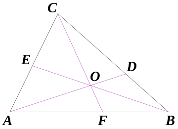

# Problem 10 : Ceva's Theorem

I got reminded of Barycentric coordinates after reminiscing one of my courses in Mass Transfer (in fact, the most memorable one). We had to make extensive use of the ternary phase diagram given that 3 species (the solvent, the solute, and the carrier) are involved in a typical extractor (a separation process).

Given a triangle ABC, let the lines AO, BO and CO be drawn from the vertices to a common point O (not on one of the sides of ABC), to meet opposite sides at D, E and F respectively.

$$
\frac{A F}{F B} \cdot \frac{B D}{D C} \cdot \frac{C E}{E A}=1
$$

# Straight line in Barycentric Coordinates

The Barycentric coordinates of a point can be considered to be set of the weights corresponding to how close the given point is to one of the three ordered vertices of the triange ABC. In fact, for a given position vector $$ \overrightarrow{P} $$ inside the triangle ABC with position vectors $$ \overrightarrow{A} $$, $$ \overrightarrow{B} $$ and $$ \overrightarrow{C} $$, we the Barycentric coordinates of P are (x,y,z) if :

$$ \overrightarrow{P} $$ = $$ x.\overrightarrow{A} + y.\overrightarrow{B} + z.\overrightarrow{C} $$

Where, $$ x + y + z = 1 $$

Now, we present a statement before proving it :

Any straight line in Barycentric coordiantes (x,y,z) can be represented as $$ ux + vy + wz = 0 $$ for suitably chosen reals $$ u $$, $$ v $$ and $$ w $$.

From the vectorial definition of Barycentric coordinates, it may be noted that for any cartesian vector $$ [x_p\; y_p] $$ (for point P), the Barycentric coordinates can be related to the vector through a linear transformation given by :

$$ \left[\begin{array}{l} x_p \\ y_p \end{array}\right] $$ = $$ \left[\begin{array}{lll} x_A & x_B & x_C \\ y_A & y_B & y_C \\ \end{array}\right] $$.$$ \left[\begin{array}{l} x \\ y \\  z \end{array}\right] $$

The equation above tells us that the coordinate transformation of Barycentric to Cartesian coordinates is linear. Using the expression in conjunction with the equation of a straight line in cartesian coordinates would eventually yield a linear combination of (x,y,z) which can be represented as $$ ux + vy + wz = 0 $$.

# Proof

It is evident that the Barycentric coordinates of A, B, and C are (1,0,0), (0,1,0) and (0,0,1) respectively. Therefore, any line passing through A would have u = 0, any line passing through B would have v =0 and any line passing through C would have w = 0.

If we consider F,D,E to have coordinates given by : F (c,1-c,0), D(0,a,1-a) and E(1-b,0,b), the equation of the lines CF, AD, BE can be written as :

$$ x = \frac{c.y}{1-c}   $$

$$ y = \frac{a.z}{1-a}   $$

$$ z = \frac{b.x}{1-b}   $$

For an intersection point O within the triangle, we multiply all the equations and see that the following equality needs to hold :

$$ abc = (1-a)(1-b)(1-c) $$

$$
\Rightarrow \frac{A F}{F B} \cdot \frac{B D}{D C} \cdot \frac{C E}{E A}=1
$$

Q.E.D.
