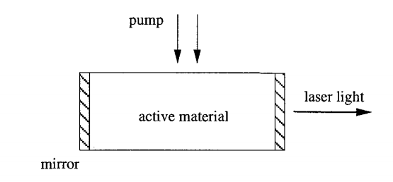
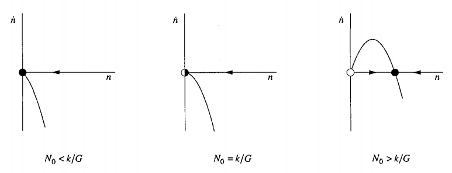
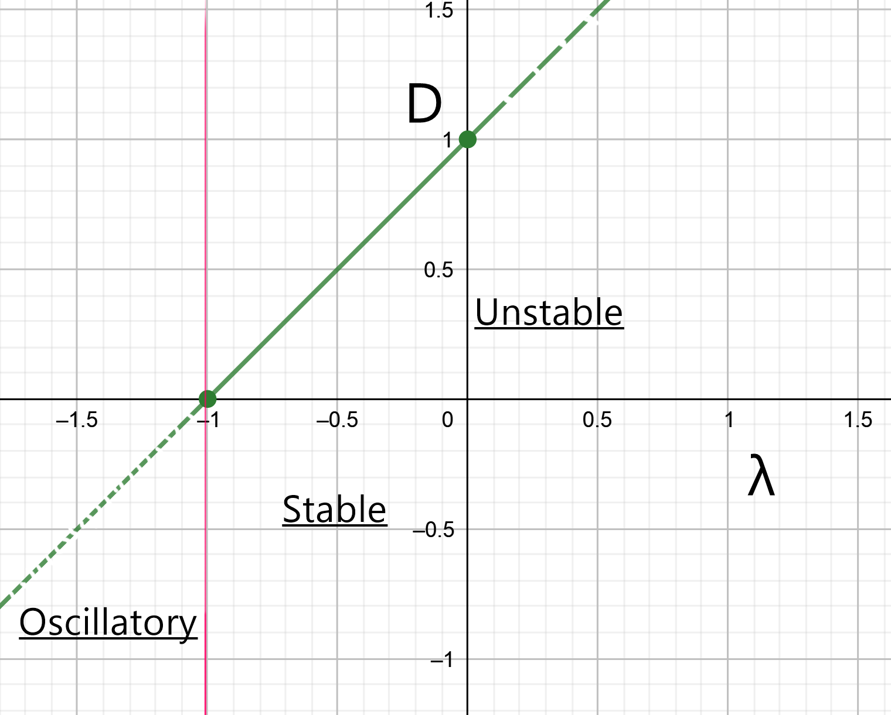

# Problem 11 : Lorentz Equation- Laser problem

Chaos, a weird still fascinating branch of mathematics that deals with nonlinear real systems and gives a non-reapeating finite values as solution for a certain range of parameter values. To start the disucssion we have to introduce the famous Lorentz equation for atmospheric covection modelling. The most simplified version is 

$$
\dot{x}=\sigma(y-x) \\
\dot{y}=rx-y-xz \\
\dot{z}=xy-bz \\
$$

Where x, y, z are the dynamical variables and $$\sigma$$, r, b are the physical parameters. Based on certain values of the variables the systems shows chaoctic behavior. In this post we are going to describe a similar system on the laser physics domain. The problem is taken from the book "Nonlinear Dynamics and Chaos" by Steven Strogatz. So, let's get started.

We are going to consider a solid state laser source that started to emit laser light upon excited by a external energy source. The energy will excite the atoms inside the active material and they emit photons of different energies. There exists a threshold limit for the number of excited atoms generated which decide the emitting light will be laser light or not. 

This phenomena is governed by the Maxwell-Bloch nonlinear equation and the simplified version is given below,

$$
\dot{E}=\kappa(P-E) \\
\dot{P}=\gamma_1(ED-P) \\
\dot{D}=\gamma_2(\lambda+1-D-\lambda EP) \\
$$

Where E,P,D are the dynamical variables and $$\kappa$$, $$\gamma_1$$, $$\gamma_2$$ and $$\lambda$$ are the system parameters.
The questions are,
(a)Show that the non-lasing state (the fixed point with E* = 0) loses stability
above a threshold value of $$\lambda$$, to be determined. Classify the bifurcation at this laser threshold.
(b)Find a change of variables that transforms the system into the Lorenz system.

# Solution

Before proceeding to the solution I will describe the simplified model and proceed to this solution. Let's say the dynamical variable is the number of photons n(t) in the laser field. The expression of n(t) can be written as,

$$
\dot{n}=gain-loss
\implies \dot{n}=GnN-kn
$$

where G is the gain coefficient and k is the loss coefficient. $$N(t)$$ is the number of excited atoms in the active material. Physically the gain terms comes from the process of $$\italics{stimulated emission}$$ which means the photons coming from the pump excite the atoms to generated more and more photons. Whereas the loss happens when the photons escapes through the endfaces of the laser.

Now both n and N are dependent on time, so, we need to have one more relation. The key physical idea is that the atoms will be down to to lower energy state after releasing a photon and then they are unable to emit another photon. This idea suggests that the number of active excited atoms drops as increase in the photon number. 

$$
N(t)=N_0-\alpha n
$$

Where $$N_0$$ is the number of excited atoms in absence of laser active(without external pump). Now combining the above equations,

$$
\dot{n}=(GN_0-k)n-(\alpha G)n^2
$$

Where G>0, k>0 and $$\alpha$$>0.

Now considering the phase plot for the dynamical variable n(t) there is a bifurcation at $$N_0=k/G$$. Below this $$N_0$$ value there will be no laser light emission as all the photons will be out of phase with each other. Beyond this value there is high increase of laser intensity and all the photons will be in the same phase. 

Now coming to our actual problem, we have to find the non-lasing state fixed point corresponding to the $$E^*=0$$ and then find out the local stability. Now it is evident from the equations that the fixed point will be,

$$
E^*=0 \\
P^*=0 \\
D^*=\lambda +1 \\
$$ 

We have to find the Jacobian matrix([Reference](https://mathworld.wolfram.com/Jacobian.html)) and find the eigen values and corresponding eigen vectors using Wolrfam Alpha computational machine,

$$
J=\begin{bmatrix}
-1 & 1 & 0 \\
\lambda +1 & -1 & 0 \\
0 & 0 & -1 \\
\end{bmatrix}
$$

Eigen values and Eigen vectors,

$$
\lambda_1= -1, v_1=\begin{pmatrix} 0 & 0 & 1 \end{pmatrix}
\lambda_2= -\sqrt{\lambda+1}-1, v_2=\begin{pmatrix}
\frac{-1}{\sqrt{\lambda+1}, & 1, & 0
\end{pmatrix}
\lambda_3= \sqrt{\lambda+1}-1, v_3=\begin{pmatrix}
\frac{1}{\sqrt{\lambda+1}}, & 1, & 0
\end{pmatrix}
$$

We know negative Eigen values denotes the stability of the system and positive Eigen values denotes the unstability of the system along its corresponding Eigen vector. In this case $$\lambda_1$$ and $$\lambda_2$$ are always negative as the system parameter $$\lambda$$ is real and greater than -1. So only $$\lambda_3$$ can take the positive value when $$\lambda >0$$ and make the system unstable.

Surprisingly there are three stability region considering the value of $$\lambda$$ and the bifurcaiton diagram shows as follows,

