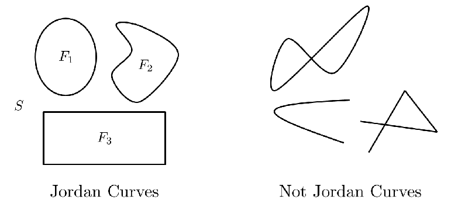
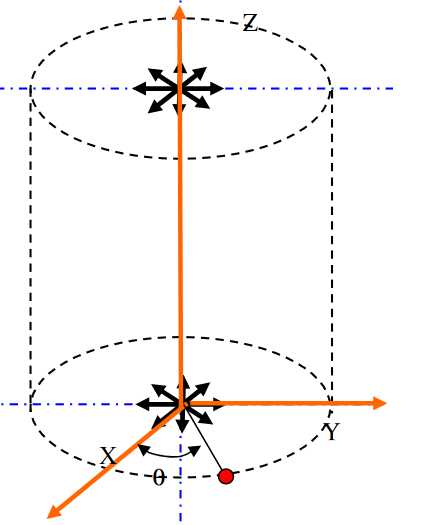

# Problem 12 : Residue Theorem

Complex numbers have enormous significance in several problems in engineering (e.g. 2-D irrotational and incompressible flow) and mathematics (e.g. Integrals, Probability). The familiar representation $$ u + iv $$ brings several things to our mind. It can be thought of merely as a complex number, represented as a point on the complex plane or even considered to be a vector with x-component equals $$ u $$ and y-component equals $$ v $$. 

# Integral of a complex function ? What's that?

Many of us who've gone through university-level preliminary mathematics courses may have compress across contour integrals like the one given below :

$$
\int_{C} f(z) d z
$$

Well, the good news is that it is not a mere extension of the real integral. There is more to it ! The first trick is to assume a parameter $$ t $$ that suitably parametrizes the counterclockwise path around our Jordan curve (google it!) C. 

The natural choice is to introduce the parameterization and rewrite the integral as follows :

$$
\int_{a}^{b} f(p(t)) p^{\prime}(t) d t
$$

Where, $$ p(t) $$ is a function which returns complex values for real $$ t $$ which goes from $$ a $$ to $$ b $$ along the contour.

Let us introduce the dot product of two complex numbers as the equivalent of the vector dot product i.e. $$ u.v = (a + ib).(c + id) = ac + bd $$ for complex numbers $$ u $$ and $$ v $$. Then, note that the product $$ \operatorname{Re}(\bar{u} v)=u \cdot v $$ and $$ \operatorname{Im}(\bar{u} v)= (iu) \cdot v $$.

Now, let us look at the contour integral of the complex conjugate of the function f(p(t)) :

$$
I = \int_{a}^{b} \overline{f(p(t))} p^{\prime}(t) d t
$$

Using the recently derived relation we can write that the Real and Imaginary parts of the integral are given by :

$$
\operatorname{Re}(I)=\int_{a}^{b} f(p(t)) \cdot d p(t) \quad \operatorname{Im}(I)=\int_{a}^{b}(i f(p(t))) \cdot d p(t)
$$

A quick observation and you will immediately realize that the Real part is actually the work done over the contour and the Imaginary part is the flux ($$ if $$ is normal to $$ f $$). [ Note: All of this holds if we consider f to define a vector field. ]

# Source in 2-D Flow

In fluid dynamics, the analysis of 2-D irrotationa and incompressible flows often involves the complex potential $$ F = \phi + i\psi $$. Where $$ \phi $$ is the potential function (its gradient gives the velocity field) and $$ \psi $$ is orthogonal to $$ \phi $$ and is known as the stream function (constant $$ \psi $$ lines are the streamlines).

Using the fact that the velocity field for a source should be proprotional to $$ 1/r $$, it can be shown that the complex potential $$ F = k.log(z) $$ where $$ k $$ is a constant.

Furthermore, if one differentiates $$ F $$ w.r.t $$ z $$ and gets simplifies the result using the definition of $$ \phi $$ and $$ \psi $$, we get that $$ \frac{dF}{dz} = F^{\prime} = u - iv $$ where $$ u $$ and $$ v $$ represent the x and y components of the fluid's velocity. Therefore, $$ \overline{F^{\prime}} = u + iv $$ can be considered to represent the velocity field. 

Let us see apply the residue theorem now ! The flux of velocity field integrated over the contour C should give an idea of the strength of the source or in fact, the fluid's flow rate. The complex conjugate of the velocity field is $$   \frac{dF}{dz} = \frac{k}{z} $$.

The residue theorem states that the integral of the aforementioned functions is simply equal to $$ 2\pi.i.k $$. Therefore, its imaginary part is $$ 2\pi.k $$. Also, the integral of the velocity field over the contour should be equal to the volume flow rate per unit depth $$ = q $$ (say).

This example was a simple use-case of a powerful method that can be used to aid the solution of more complicated 2-D fluid flow fields. 

Thanks for reading till this point !

Proof of the Residue Theorem : [Proof]()

