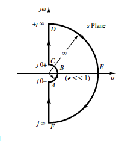

# Problem 13 : The Nyquist Criterion

No matter which department it is, the Control course has an entire section that talks about the stability of a closed control loop (the full diagram with the controller). The whole ordeal becomes
much easier with Laplace domain analysis using the transfer function (TF) [Output/Input in Laplace Domain] of the closed loop. The roots of the numerator of the transfer function are known as zeros and the roots of the denominator are the poles. We are usually concerned with the poles of the closed loop transfer function which are responsible for the temporal stability/instability of the resulting loop (Check by taking an Inverse Laplace Transform for a step input). It is easy to see that the Right Half Plane (RHP) poles make the TF unstable.

In this article, we present a proof of the Nyquist Criterion and relevant visualization of the Laplace domain. Before discussing anything we would like to introduce the graphical idea using the poles and zeros.

The generalized transform function given below:

$$
TF(s)=\frac{Y(s)}{X(s)}=\frac{A\left(s-z_{1}\right)\left(s-z_{2}\right) \ldots\left(s-z_{m}\right)}{\left(s-p_{1}\right)\left(s-p_{2}\right) \ldots\left(s-p_{n}\right)}
$$

Where $$ Y $$ is the output, $$ X $$ is the input and all the coefficients are real. It is generally seen that $$ n > m $$ for physically realizable systems.

Now, consider an arbitrary zero $$ z_{i} $$. For a point at a polar angle $$ \theta $$ and at a distance $$ r $$ from $$ z_{i} $$, $$ (s-z_{i}) $$ can be represented as $$ r.e^{j\theta} $$. Furthermore,
the contribution of this term within the transfer function is in the numerator implying that a clockwise rotation of the point around the zero would lead to a clocwise rotation of the point's image (in the TF-domain) that represents the transfer function in the complex plane.

Again, consider an arbitrary pole $$ p_{i} $$. For a point at a polar angle $$ \theta $$ and at a distance $$ r $$ from $$ p_{i} $$, $$ (s-p_{i}) $$ can be represented as $$ r.e^{j\theta} $$. Now, the contribution of this term within the transfer function is in the denominator implying that a clockwise rotation of the point around the zero would lead to a counterclocwise rotation of the point that represents the transfer function in the complex plane.

We shall combine the two concepts now. If we take all of the poles and zeros inside a closed contour, the zeros would add a conrotatory effect and the poles would add a disrotatary effect in the mapping between
the s-domain (the moving point on the contour) and the TF-domain (the resulting complex valued transfer function on the complex plane).

To check the number of RHP poles in the closed loop transfer function we can simply pick the denominator of the closed loop transfer function which turns out to be $$ = 1 + G_{p}.G_{c} $$ (where $$ G_{p}.G_{c}$$ is the open loop transfer function). In other words, we want to check if any of the roots of the equation $$ G_{p}.G_{c} = -1 $$ lie in the RHP. To this end, we take the function $$ G_{p}(s).G_{c}(s) $$ and look at the trajectory of the point corresponding to the value of $$ G_{p}(s).G_{c}(s) $$ for a point $$ s $$ in the s-domain that moves along a cleverly chosen contour given below:

This clever choice of the contour allows us to cover all the zeros and poles in the right half plane only. The trajectory of the point that represents open loop transfer function ($$G_{p}.G_{c}$$) can then be
termed as the Nyquist Plot of the transfer function. So, the Nyquist Plot is simply the plot of all the values the open loop transfer function takes as $$ s $$ goes from $$ -j\inf$$ to $$+j\inf$$.

# Nyquist (Stability) Criterion

First, note that the poles of $$ G_{p}.G_{s} $$ are the same as the poles of $$ 1 + G_{p}.G_{s} $$. For the sake of simplicity one can also assume that the open loop transfer function is stable and hence, it has no poles in the RHP.

Assuming that we already know the poles of the open loop transfer function $$ (OLTF) $$, we just need to find the roots/zeros of $$ 1 + G_{p}.G_{c} $$. The Nyquist Criterion states that this can be done by noting the
number of encirclements of the point (-1,0) in the Nyquist plot of the open loop transfer function $$ G_{p}.G_{c} $$. Makes sense, right? Explanation ahead -

We already know that the rotations around the zeros lead to conrotatory contributions and those around the poles lead to a disrotatary contributions. Therefore, the number of clockwise encirclements of (-1,0) in the Nyquist plot should give us the number $$ N $$ which equals $$  Z - P $$ where $$ Z $$ and $$ P $$ are the number of zeros and poles of the $$ 1 + OLTF $$ in the RHP.

# Try it yourself !

Just go ahead and run the Python notebook for a simple OLTF with a pole at (-1,0). Move the point around (-1,0) to see the disrotatary effect. Feel free to check the code for other Transfer Functions by modifying the TF function defined in the beginning of the code.

<video controls autoplay style=" display: block; margin-left: auto; margin-right: auto;width: 75%;" src="../assets/prob13_vid.mp4"></video>

[Cick Here](https://mybinder.org/v2/gh/Oscuro-Phoenix/math-for-fun/master?filepath=notebooks%2FComplex_Mapper.ipynb)

[Get the .py script](../notebooks/complex-mapper.py)
