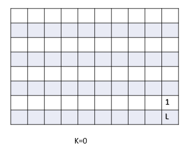
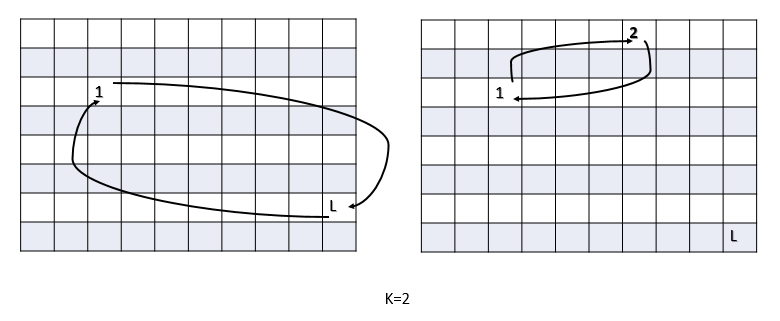

# Problem 11 : Airplane Seat Problem

Imagine there are n number of people in line to board a plane that has the same number of seats. The first person in line realizes he lost his boarding pass so when he boards he decides to take a random seat instead. Every person that boards the plane after him will either take their "proper" seat, or if that seat is taken, a random seat instead.

Question: What is the probability that the last person that boards will end up in his/her proper seat.

# Solution

Before proceeding to the solution let's recapitulate the fundamental definition of probability.

P(event A)=Number of cases where event A takes place/Total number of events possible

In our problem the event is the last person getting his\her alloted seat at the end of everyone's boarding.

Now consider, let's say k number of people don't get their allocated seat and the rest n-k people get their proper one. The value of k should be from 0 to n excuding 1 because only 1 person sitting at other's seat practically impossible.

 So, among all the possible cases the best case corresponds to k=0 where no one sits on wrong seat. The first person coincidently sits on his actual seat. As a result all the remaining passengers also sit on their respective seats including the last one. 

$$\underline{k=2} \\$$
(i) The next best case is the first person sits on the last person's seat and all the passengers except the last one get their alloted seats. The last person sits on the alloted seat of the first person that said on the wrong sit.(corresponding to k=2)

(ii)The second case for k=2 where the first person and another person switch their seats but the the last person get his alloted seat.

$$\underline{k=3} \\$$
(i)Proceeding to the next best case, where the first person sits on another person's seat and that person sits on the first person's seat. So, everone remaining get their repective seats as well as the last passenger. 

(ii)Similarly, the next case will be when the first passenger sits on another person's seat and that person sits on the last's passenger's seat. The last passenger will get the wrong seat as all the remaining seats are filled by then.(k=3) 

So, in general in ease case k people fall into a loop where they sits in each other's seats. But the remaining people get to sit on their repective ones. There is two possible cases for each of the remaining values of k in which exactly half cases leads to the correct seat for the last person. So the total number of cases =$$1+1+2*(n-2)=2n-2$$ and the event A occurs in $$n-1(1+n-2)$$ cases.

This analysis leads to the probability = $$\frac{n-1}{2n-2}=\frac{1}{2}$$

