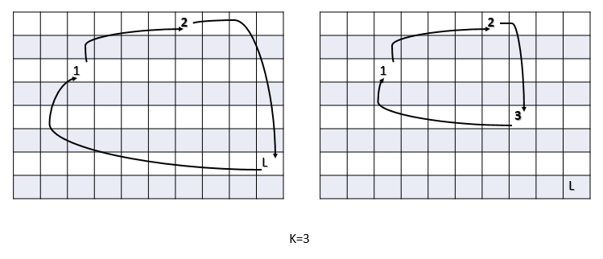

# Problem 11 : Airplane Seat Problem

Imagine there are n number of people in line to board a plane that has the same number of seats. The first person in line realizes he lost his boarding pass so when he boards he decides to take a random seat instead. Every person that boards the plane after him will either take their "proper" seat, or if that seat is taken, a random seat instead.

Question: What is the probability that the last person that boards will end up in his/her proper seat.

# Solution

Before proceeding to the solution let's recapitulate the fundamental definition of probability.

P(event A)=Number of cases where event A takes place/Total number of events possible

In our problem that event is the last person getting his\her alloted seat at the end of everyone's boarding.

Now consider, k number of people don't get their allocated seat and the rest (n-k) people get their proper one. The value of k should be from 0 to n excuding 1 because only 1 person sitting on other's seat is practically impossible.

 So, among all the possible cases the best case corresponds to k=0 where no one sits on wrong seat. The first person coincidently sits on his actual seat. As a result all the remaining passengers also sit on their respective seats including the last person. 

$$\underline{k=2} \\$$
(i) The next best case is the first person sits on the last person's seat and all the passengers except the last one get their alloted seats. The last person sits on the alloted seat of the first person that said on the wrong seat.

(ii)The second case for k=2 where the first person and another person switch their seats but the the last person get his alloted seat.

$$\underline{k=3} \\$$
(i)Proceeding to the next best case, where the first passenger sits on another person's seat and that person sits on the last's passenger's seat. The last passenger will get the wrong seat as all the remaining seats are filled by then.

(ii)Similarly, the next case will be when the first passenger sits on another person's seat and that person sits on the 3rd person's seat in the loop. The 3rd person will sit on the first person's seat which ends the loop. The last passenger will get the correct seat as well as the remaining passengers.

In the given figures, the boxes depict the seats and the numerical alphabets represents the marking of the person sitting in the wrong seat as they enter. In the first figure all the people sit in their actual seats and the first person(1) and the last person(L) both sit in their actual seats. 

Moving on the next picture there are 2 persons sitting on the wrong seat; 1 and L in the first case and 1 and 2 in the second case. Here L sits in the wrong seat in the former picture and in the correct seat in the later. This schematic matches with the k=2 discussion earlier.

In the last couple of figures, for k=3, either (1,2,L) or (1,2,3) completes the loop with wrong seats and similar to the previous case in one of the cases the last person(L) sits on the correct seat.

So, in general in each case k people fall into a loop where they sits in each other's seats. But the remaining people get to sit on their repective ones. The best case is corresponding to k=0 where the last person gets the correct seat. The worst case where all the people sits in the wrong seats(k=n) and the last person sits on the wrong seat. There are two possible cases for each of the remaining values of k in which exactly half cases lead to the correct seat for the last person. 

So the total number of cases possible=$$1+1+2*(n-2)=2n-2$$ and the event occurs in $$n-1(1+n-2)$$ cases. This analysis leads to the probability = $$\frac{n-1}{2n-2}=\frac{1}{2}$$

