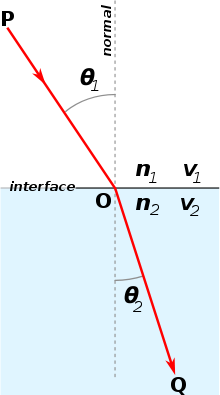
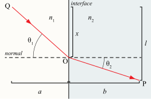

# Problem 16 : Optics: Snell's law

A lifeguard on a beach spots a swimmer in trouble some distance away, in a diagonal direction. He can run three times faster than he can swim. What is the quickest path to the swimmer?

Famous theoretical phycist Dr. Richard Feynmann asked this practical problem while talking about the Snell's law. We may know what is snell's law from our school days but the extent of research that was behind Optics during the past 4 centuries creates the base of our modern physics perspective. In this article we discuss about the above problem and solve it.

# Solution

What is Snell's Law?

the ratio of the sines of the angles of incidence and refraction is equivalent to the ratio of phase velocities in the two media, or equivalent to the reciprocal of the ratio of the indices of refraction.

$$
\frac{sin\theta_2}{sin\theta_2}=\frac{v_2}{v_1}=\frac{n_1}{n_2}
$$

Well experimentalists already proved this relationship between the incident and refractive angle to the respective fraction index of the mediums, but there are proofs based on theoretical principles. The most well accepted one is using Fermat's principle of least time. 
He stated: $$ \textit{Light travels between two points in such a way that the total time traveled is a minimum}$$. Since light travels at different speeds through different media, the path of least time may not be a straight line. In particular, light travels a longer distance in the medium in which it has a higher speed. 
This concept is directly related to our above problem when you compare lifeguard with the light. The main objective to find out the least time taken by the lifeguard who should follow the path of light.

Now let's dig into the proof. 

As shown in the figure to the right, assume the refractive index of medium 1 and medium 2 are $${\displaystyle n_{1}}$$ and $${\displaystyle n_{2}}$$ respectively. Light enters medium 2 from medium 1 via point O.

$${\displaystyle \theta_{1}}$$ is the angle of incidence, $${\displaystyle\theta_{2}}$$ is the angle of refraction with respect to the normal.

The phase velocities of light in medium 1 and medium 2 are $${\displaystyle v_{1}=c/n_{1}}$$ and $${\displaystyle v_{2}=c/n_{2}}$$ respectively. $${\displaystyle c}$$ is the speed of light in vacuum.

Let T be the time required for the light to travel from point Q through point O to point P.

$${\displaystyle T={\frac {\sqrt {x^{2}+a^{2}}}{v_{1}}}+{\frac {\sqrt {b^{2}+(l-x)^{2}}}{v_{2}}}={\frac {\sqrt {x^{2}+a^{2}}}{v_{1}}}+{\frac {\sqrt {b^{2}+l^{2}-2lx+x^{2}}}{v_{2}}}}$$ \\
where a, b, l and x are as denoted in the right-hand figure, x being the varying parameter.

To minimize it, one can differentiate :

$${\displaystyle {\frac {dT}{dx}}={\frac {x}{v_{1}{\sqrt {x^{2}+a^{2}}}}}+{\frac {-(l-x)}{v_{2}{\sqrt {(l-x)^{2}+b^{2}}}}}=0}$$ (stationary point) \\
Note that $${\displaystyle {\frac {x}{\sqrt {x^{2}+a^{2}}}}=\sin \theta_{1}}$$ and $${\displaystyle {\frac {l-x}{\sqrt {(l-x)^{2}+b^{2}}}}=\sin \theta_{2}}$$

Therefore,
	
$${\displaystyle {\frac {dT}{dx}}={\frac {\sin \theta_{1}}{v_{1}}}-{\frac {\sin \theta _{2}}{v_{2}}}=0}$$

$${\displaystyle {\frac {\sin \theta_{1}}{v_{1}}}={\frac {\sin \theta_{2}}{v_{2}}}} \\
{\displaystyle {\frac {n_{1}\sin \theta_{1}}{c}}={\frac {n_{2}\sin \theta_{2}}{c}}} \\
{\displaystyle n_{1}\sin \theta_{1}=n_{2}\sin \theta_{2}}$$(Hence Proved)