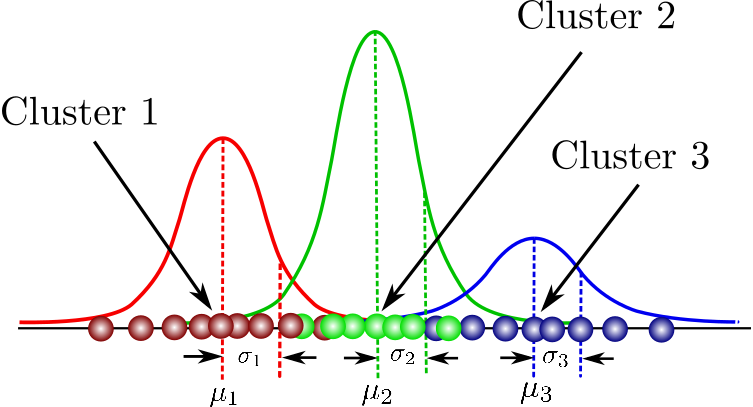

# Problem 18: Mixture of Gaussians - A Soft Classification Approach (ft. Jensen's Inequality)

The Bayesian framework for solving problems has already turned into a phenomenon. A hard classification approach like the K-means algorithm does not let you discuss about uncertainty or certainty with which you can say that a data point belongs to a specific class/group. This calls for a probabilistic approach and the Gaussian Mixture Model (GMM) which has been around for more than three decades. 

<figure>

<figcaption>A simplified case with GMM classification over a single dimension</figcaption>
 

The figure given above shows a simple case where we consier classification among three classes over a single dimension. This dimension could be a characteristic like petal width for the Iris classification problem. It may be noted that the some of the parameters which are clearly visible in the figure include the mean (vector) and variance-covariance (matrix) of each of the elemental Gaussian distributions. 

Let us now introduce a latent variable \(t_{i} \) the value of which for a given data point and parameters represents the Gaussian to which the data point belongs. In mathematical terms, we want to say that :

$$ P\left(t_{i}=j \mid x_{i}, \Theta\right)  $$ is the probability that \( x_{i} \) belongs to the \( j^{th} \) Gaussian.

We want our GMM to explain the data really well. This really means that we want the probability of the data (X) given the parameters \( \Theta \) to be as high as possible. Experienced folks would now realize that we are hinting towards the Maximum Likelihood Estimation (MLE).

Accordingly, we can write our objective as the maximization of the log of this distribution of the data given parameters. We take the logarithm to make the math easier. The objective can be mathematically expressed as follows:

$$
\max _{\Theta} \log P(X \mid \Theta)=\max _{\Theta} \log \left(\prod_{i} P\left(x_{i} \mid \Theta\right)\right)=\max _{\Theta} \sum_{i} \log \left(P\left(x_{i} \mid \Theta\right)\right)
$$

Direct analytical solution or Gradient descent are usually infeasible due to issues like lack of an analytical solution or difficult constraints (covariance matrix should be positive semidefinite). There is an iterative approach known as Expectation-Maximization Algorithm (EM Alogrithm) that can be utilised to get close enough to the optimum parameters. 

I will link the detailed proof of the E-step and the M-step at the bottom. For now, let us keep it concise and focus on the conceptual understanding behind the steps -

 - Obtain a lower bound for the Likelihood : 

 To do this we introduce a new distribution (q) over the latent variable \( t_{i} \) which would help us tweak a lower bound of the objective function so that we can minimize the difference between the lower bound and the objective function. The fact that direct optimization of the objective function is hard motivates us to go for something like this. The distribution (q) is added in a clever manner by rewriting our objective and employing the Jensen's Inequality :

 $$
\begin{aligned}
\log \left(P\left(x_{i} \mid \Theta\right)\right) &=\log \left(\sum_{j=1}^{K} P\left(x_{i} \mid t_{i}=j, \Theta\right) P\left(t_{i}=j \mid \Theta\right)\right) \\
&=\log \left(\sum_{j=1}^{K} P\left(x_{i}, t_{i}=j \mid \Theta\right)\right) \\
&=\log \left(\sum_{j=1}^{K} \frac{q\left(t_{i}=j\right)}{q\left(t_{i}=j\right)} P\left(x_{i}, t_{i}=j \mid \Theta\right)\right) \\
&=\log \left(\sum_{j=1}^{K} q\left(t_{i}=j\right) \frac{P\left(x_{i}, t_{i}=j \mid \Theta\right)}{q\left(t_{i}=j\right)}\right)
\end{aligned}
$$

$$
\log \left( P\left(x_{i} \mid \Theta\right) \right) =\log \left(\sum_{j=1}^{K} q\left(t_{i}=j\right) \frac{P\left(x_{i}, t_{i}=j \mid \Theta\right)}{q\left(t_{i}=j\right)}\right) \geqslant \sum_{j=1}^{K} q\left(t_{i}=j\right) \log \left(\frac{P\left(x_{i}, t_{i}=j \mid \Theta\right)}{q\left(t_{i}=j\right)}\right)=L_{i}(\Theta, q)
$$

Note that the overall objective function is the sum of \( P\left(x_{i} \mid \Theta\right) \) over all i data points.  

- E-Step : Minimizing the difference between the lower bound and the actual objective function yields the expression of the distribution q over \( t_{i} \) which can be derived as follows:

$$ L_{i}(\Theta, q) - \log \left(P\left(x_{i} \mid \Theta\right)\right) $$

$$ = \sum_{j=1}^{K} q\left(t_{i}=j\right) \log \left(\frac{P\left(t_{i}=j \mid x_{i}, \Theta\right)}{q\left(t_{i}=j\right)}\right) + \sum_{j=1}^{K} q\left(t_{i}=j\right) \log \left(P\left(x_{i} \mid \Theta\right) \right) - \log \left(P\left(x_{i} \mid \Theta\right) \right) $$

 $$ = \sum_{j=1}^{K} q\left(t_{i}=j\right) \log \left(\frac{P\left(t_{i}=j \mid x_{i}, \Theta\right)}{q\left(t_{i}=j\right)}\right) $$

The expression above is the KL-divergence between q and \( P\left(t_{i}=j \mid x_{i}, \Theta\right) \) which can be shown to be minimum when \(  q = P\left(t_{i}=j \mid x_{i}, \Theta\right) \).

Furthermore, using Bayes' Theorem it can be seen that 

$$
P\left(t_{i} \mid x_{i}, \Theta\right)=\frac{P\left(x_{i} \mid t_{i}=j, \Theta\right) P\left(t_{i}=j \mid \Theta\right)}{P\left(x_{i} \mid \Theta\right)}
$$

Replacing the probabilities with respective parameters we have: 

$$
P\left(t_{i}=j \mid x_{i}, \Theta\right)=\frac{P\left(x_{i} \mid t_{i}=j, \Theta\right) P\left(t_{i}=j \mid \Theta\right)}{\sum_{k=1}^{K} P\left(x_{i} \mid t_{i}=k, \Theta\right) P\left(t_{i}=k \mid \Theta\right)}=\frac{\alpha_{j} N\left(x_{i} \mid \mu_{j}, \Sigma_{j}\right)}{\sum_{k=1}^{K} \alpha_{k} N\left(x_{i} \mid \mu_{k}, \Sigma_{k}\right)}
$$

Therefore, we now have a rule to update q each time we update the parameter set \( \Theta \).  

- M-step : This essentially involves a parameter update for a given distribution q. I am skipping the full derivation since the update formulae are pretty intuitive. We need to update the weights \( \alpha_{j} \), mean vectors and the covariance matrices. The formulae are given below:

$$
\alpha_{j}=\frac{\sum_{i} q\left(t_{i}=j\right)}{\sum_{j^{\prime}=1}^{K} \sum_{i} q\left(t_{i}=j^{\prime}\right)}
$$

$$
\mu_{j}=\frac{\sum_{i} q\left(t_{i}=j\right) x_{i}}{\sum_{i} q\left(t_{i}=j\right)}
$$

$$
\Sigma_{j}^{T}=\frac{\sum_{i} q\left(t_{i}=j\right)\left(x_{i}-\mu_{j}\right)\left(x_{i}-\mu_{j}\right)^{T}}{\sum_{i} q\left(t_{i}=j\right)}
$$

[Source](a.com)