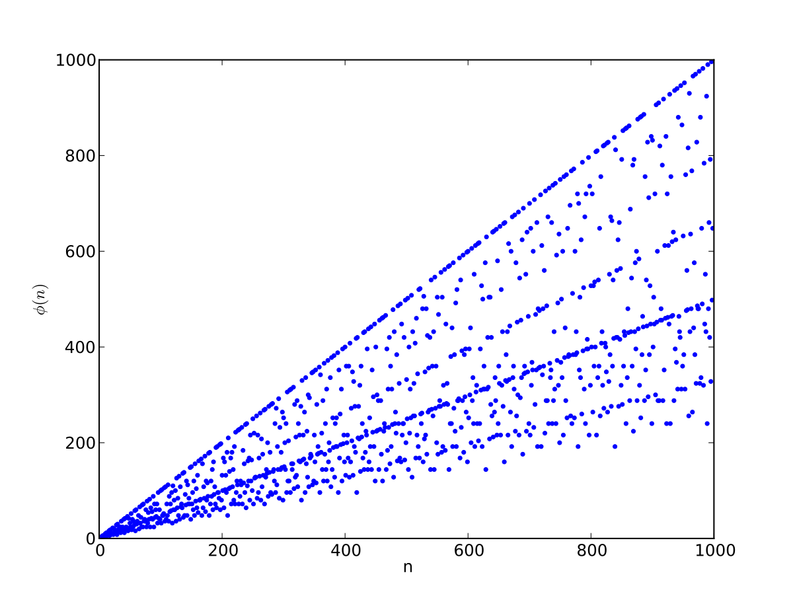

# Problem 19: Sum of GCD of x with all natural numbers till x 

The title of the problem summarises the problem at hand. We are basically going to try and see if we can efficiently find the following sum as a function of x -

$$
F(x)=G C D(1, x)+G C D(2, x)+\ldots+G C D(x, x)
$$

## Solution

Let us go straight to the point. One can see that the GCD of x with say, a number y which does not divide x will be 1. Furthermore, GCD(y,x) is always less than y as GCD(y,x) is a divisor of y too. Let us assume that the GCD of y and x is the number denoted by g. 

Since g is the greatest divisor which is common to the set of divisors of both y and x, it can be reasoned out that y/d and x/g have no divisor in common except 1. In other words, GCD(y/g,x/g) = 1.

We can further simplify the problem by finding the number of times GCD(y,x) = g for y between 1 and x. This will only happen with those numbers y which are a multiple of g. In other words, the number of occurences of GCD(y/g,x/g) = 1 for y in between 1 and x will be the Euler Totient function of x/g which counts the number of non-divisors of x/g.

The Euler Totient Function can be found by noting that the divisors of x/g within 1 to sqrt(x/g). Furthermore, any multiple of the divisors of x/g (except 1) will definitely not yield a GCD of 1. Let x/g be denoted as n, then we can find the divisors of n. Let us denote the divisors as p1 (in ascending order from i = 1 to k) we will try to demonstrate that the Euler Totient Function of n is given by the Euler Product Formula which states that 

$$
\varphi(n)=n \prod_{p_{i} \mid n}\left(1-\frac{1}{p_{i}}\right)
$$

<figure>

<figcaption>A plot of the Euler Totient Function of n (Source: Second link in references)</figcaption>
 

</figure>

## Demonstration of the Euler Product Formula

Let us do this in an intuitive way.

Multiply the product of the left side and see the magic unfold. 

The first term in the product is 

$$

T_{1} = n - \frac{n}{p_{1}}
$$

which basically says that we subtract the all the multiples of p1 from n i.e. the total number of natural numbers between 1 and n (inclusive).

Now go for the next term in the product,

$$

T_{2} = T_{1} - \frac{T_{1}}{p_{2}}
      = T_{1} - \frac{n - \frac{n}{p_{1}}}{p_{2}}
      = n - \frac{n}{p_{1}} - \frac{n}{p_{2}} + \frac{n}{p_{1}.p_{2}}

$$

We see the beautiful Inclusion-Exclusion Principle in action here, when the multiples of p1 and multiples of  p2 are subtracted we also make the error of subtracting the multiples of both twice. So, we amend our mistake by adding that the fourth term.

Continue doing this and check if for yourself!

## References

[Inclusion-Exclusion Principle](https://brilliant.org/wiki/principle-of-inclusion-and-exclusion-pie/)
[Euler's Totient Function](https://en.wikipedia.org/wiki/Euler%27s_totient_function)
[Problem Statement](https://www.geeksforgeeks.org/sum-of-gcd-of-all-numbers-upto-n-with-n-itself/)

