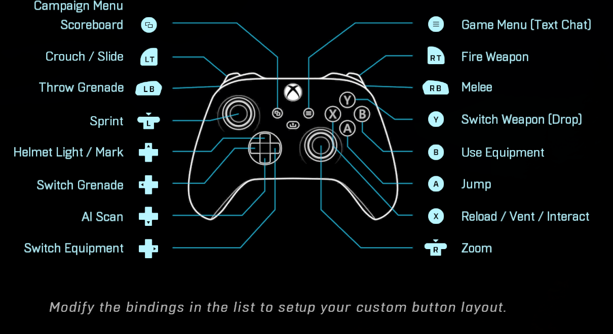

# Problem 20: Controller Settings and Stirling Numbers 

I've played a fare share of games and a couple of those were better played using a controller. In a typical Xbox/PS controller we have 4 direction buttons, 4 action buttons, 4 back buttons (LB/L1, LT/L2, RB/R1, RT/R2), 2 start/select buttons and the 2 analog stick press (L3/R3) buttons (Total of 16 buttons). Let us generalize this and say that we have a total of m buttons. 

<figure>

<figcaption>Xbox Controller Bindings for Halo Infinite (Source: Second Link in References)</figcaption>
 

</figure>

Consider that we have two types of games. One (Type 1) is a game like Rocket League that allows assignment of the same button for two different actions (Example - L1 can be used for Ball Focus and Air Roll). The other type (Type 2) of game throws a warning or does not allow you to assign a single button for two different tasks (no repeats allowed). Assume that both games require you to assign some button to each action.

Finally, let us assume that the number of button assignments to be performed is n and it is less than m (may not hold for many fighting games). We will go ahead and find out the difference in the number of additional ways in which the player can assign buttons in the first type of game compared to the second one given that they both have the same n. 

## Solution

Let us go for the easier case first. For Type 2 games, we can easily note that the problem reduces to choosing & assigning n buttons from the m total buttons. And this is simply given by $${}^mC_n n! = {}^mP_n$$.

For Type 1 games, we can recast the problem into a commonly encountered mathematical statement. The goal is to assign buttons to $n$ actions. If we assume that the set of buttons say, $$B$$ is the domain and the set of assignments $$A$$ is the co-domain. Then the problem reduces to finding the number of onto functions (i.e. functions that relate each element of $$A$$ (co-domain) to some element in the $$B$$ (domain)).

Thankfully, we have the famous Principle of Inclusion & Exclusion (PIE) to our rescue! But I won't directly use it here. Instead, we will actually solve the problem to develop the intuition behind PIE.

First, let us count the number of ways in which any function from $$B$$ to $$A$$ can be defined (may or may not be onto).  Since each element in the domain, $$B$$ of size $$m$$ has $$n$$ options, the total number of ways of mapping any combination of elements of $$B$$ to $$A$$ is $$n^m$$. But we are not interested in those mappings that leave out any of the elements of $$A$$.

As a first improvement we can subtract out those mappings that leave out one element of $$A$$. The number of such mappings would be given by the number of ways of choosing one element of $$A$$ that will remain unmapped times the number of ways of mapping the rest $$n-1$$ elements in A i.e. $${}^nC_1 (n-1)^m $$.

The second improvement would require us to add those mappings that leave out two elements of $$A$$. The logic behind adding lies in the fact that we inadvertedly subtracted the mappings that leave out two elements twice in the last step (Why? - This can be seen by considering a simple case where $$m$$ = 1 and $$n$$ = 3). So, we need to add the number of ways of choosing two elements that would be left out times the number of ways of mapping the rest $$n-2$$ elements in $$A$$ i.e. $${}^n C_2 (n-2)^m $$.

Building up in a similar way we would find that the sum becomes -

$$
Z(m,n) = n^m - {}^nC_1 (n-1)^m +{}^nC_2 (n-2)^m - {}^nC_3 (n-3)^m + {}^nC_4 (n-4)^m - ..... (-1)^(n-1) {}^nC_{n-1} (1)^m    
$$

Using a short MATLAB script, for a value of $$ m = n = 16$$ we find that the complicated sum above is 16! or $${}^{16} P_{16}$$. This was expected because in this case the problem reduces to permuting 16 items. Also, for games for Type 2 the total number of ways turns out to be the same! So, when $$m = n$$ the difference in the number of ways of fixing the control settings is the same. Also, note that we have an interesting series representation of $$N!$$ now which can be found by plugging $$n = m = N$$.

In case, $$ n = 15$$, $$m = 16$$ we find that the sum for games of Type 1 is 120 x 15!. On the other hand, the value of $$ {}^{16} P_{15}$$ is still 16!. Interesting! So, now the difference between the number of ways becomes 104 x 16!.

##Ending note
The series above is closely related to the Stirling Numbers of the Second Kind (S(n,k)) that counts the total number of ways to partition an n element set into k blocks or non-empty subsets. In fact, $$ S(m,n) = Z(m,n)/n! $$. Read more through our last reference.

## References

[Inclusion-Exclusion Principle](https://brilliant.org/wiki/principle-of-inclusion-and-exclusion-pie/)

[Controller Layout](https://www.google.com/url?sa=i&url=https%3A%2F%2Fpericror.com%2Ftech%2Fthe-best-halo-infinite-controller-binding%2F&psig=AOvVaw1toiVryOtFj9t5gmV29vCJ&ust=1640144018757000&source=images&cd=vfe&ved=0CAgQjRxqFwoTCMjy0eD68_QCFQAAAAAdAAAAABA_)

[Stirling Numbers of the Second Kind](http://discrete.openmathbooks.org/more/mdm/sec_adv-stirling.html)