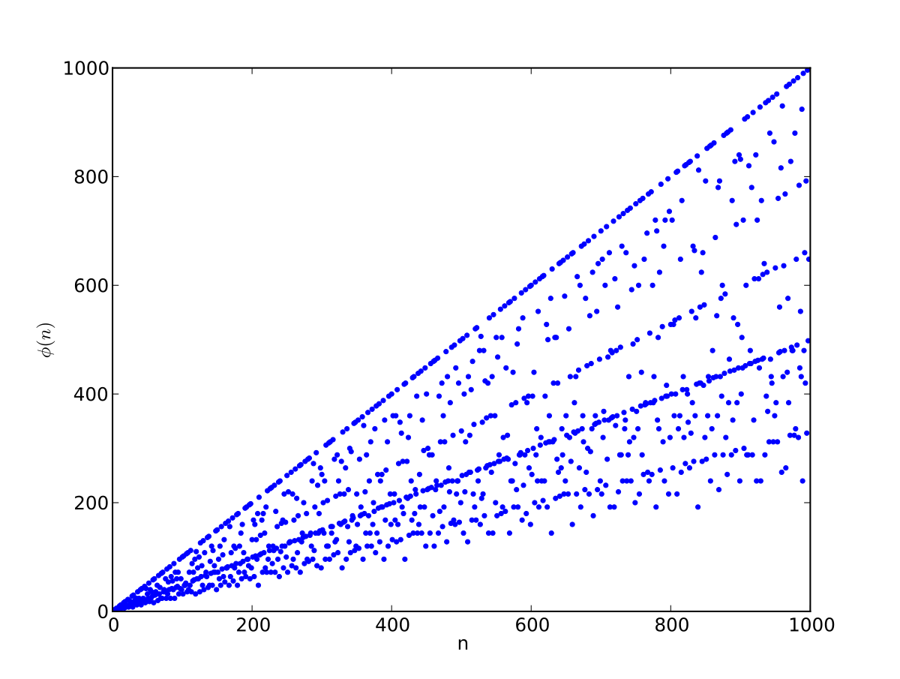

# Problem 20: Controller Settings and Stirling Numbers 

I've played a fare share of games and a couple of those were better played using a controller. In a typical Xbox/PS controller we have 4 direction buttons, 4 action buttons, 4 back buttons (LB/L1, LT/L2, RB/R1, RT/R2), 2 start/select buttons and the 2 analog stick press (L3/R3) buttons. Let us generalize this and say that we have a total of m buttons. 

Consider that we have two types of games. One (Type 1) is a game like Rocket League that allows assignment of the same button for two different actions (Example - L1 can be used for Ball Focus and Air Roll). The other type (Type 2) of game throws a warning or does not allow you to assign a single button for two different tasks (no repeats allowed). Assume that both games require you to assign some button to each action.

Finally, let us assume that the number of button assignments to be performed is n and it is less than m. We will go ahead and find out the difference in the number of additional ways in which the player can assign buttons in the first type of game compared to the second one given that they both have the same n. 

## Solution

Let us go for the easier case first. For Type 2 games, we can easily note that the problem reduces to choosing n buttons from the m total buttons. And this is simply given by $${}^nC_m$$.

For Type 1 games, we can recast the problem into a commonly encountered mathematical statement. The goal is to assign buttons to $n$ actions. If we assume that the set of buttons say, $$B$$ is the domain and the set of assignments $$A$$ is the co-domain. Then the problem reduces to finding the number of onto functions (i.e. functions that relate each element of $$A$$ (co-domain) to some element in the domain, $$B$$)

$$
\varphi(n)=n \prod_{p_{i} \mid n}\left(1-\frac{1}{p_{i}}\right)
$$

<figure>

<figcaption>A plot of the Euler Totient Function of n (Source: Second link in references)</figcaption>
 

</figure>

## Demonstration of the Euler Product Formula

Let us do this in an intuitive way.

Multiply the product of the left side and see the magic unfold. 

The first term in the product is 

$$

T_{1} = n - \frac{n}{p_{1}}
$$

which basically says that we subtract the all the multiples of p1 from n i.e. the total number of natural numbers between 1 and n (inclusive).

Now go for the next term in the product,

$$

T_{2} = T_{1} - \frac{T_{1}}{p_{2}}
      = T_{1} - \frac{n - \frac{n}{p_{1}}}{p_{2}}
      = n - \frac{n}{p_{1}} - \frac{n}{p_{2}} + \frac{n}{p_{1}.p_{2}}

$$

We see the beautiful Inclusion-Exclusion Principle in action here, when the multiples of p1 and multiples of  p2 are subtracted we also make the error of subtracting the multiples of both twice. So, we amend our mistake by adding that the fourth term.

Continue doing this and check if for yourself!

## References

[Inclusion-Exclusion Principle](https://brilliant.org/wiki/principle-of-inclusion-and-exclusion-pie/)

[Euler's Totient Function](https://en.wikipedia.org/wiki/Euler%27s_totient_function)

[Problem Statement](https://www.geeksforgeeks.org/sum-of-gcd-of-all-numbers-upto-n-with-n-itself/)

