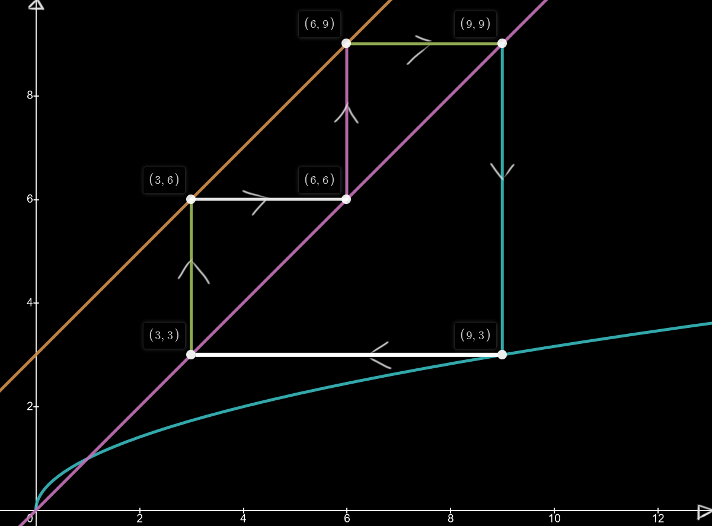

# Problem 21: Stuck in a Loop (IMO 2017 P1)
The problem statement has been provided in the references. I will go through it here too but in a different way. 

Let us say that you are escaping a pursuer on a 1-D "lattice"/space where each step takes you 3 distance units ahead. You can only take an integer number of steps and you start running from a point that has an integer coordinate (i.e. > 1). If you kept walking normally, you would wander off and never return back. As usual, the game isn't simple and if you are unlucky you step on a point that has a perfect square coordinate, you must go back to the point that is the square root of the coordinate. The pursuer tells you that you're bound to eventually get caught and you're just wasting your strength ! Why is this true?

# Solution

The problem can be formally written as follows -

For a starting point $$a_{0}>1$$, define the sequence $$a_{0}, a_{1}, a_{2}, \ldots$$ by:
$$
a_{n+1}=\left\{\begin{array}{ll}
\sqrt{a_{n}} & \text { if } \sqrt{a_{n}} \text { is an integer, } \\
a_{n}+3 & \text { otherwise, }
\end{array} \quad \text { for each } n \geqslant 0 .\right.
$$

 where the sequence $$a_{0}, a_{1}, a_{2}, \ldots, a_{n} $$ is the sequence of coordinates through which you passed after n-steps.

Before we start drawing, let us note one important thing - Any perfect square is either $$ \equiv 1 mod 3 $$ or $$ \equiv 0 mod 3 $$. 

<figure>

<figcaption>Representation of the sequence on a graph</figcaption>
 

 
</figure>

## References

[Problem Statement](http://imo-official.org/year_info.aspx?year=2017)