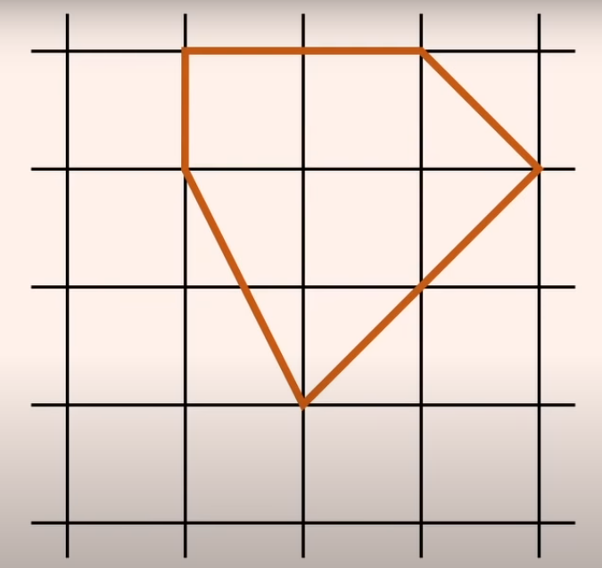
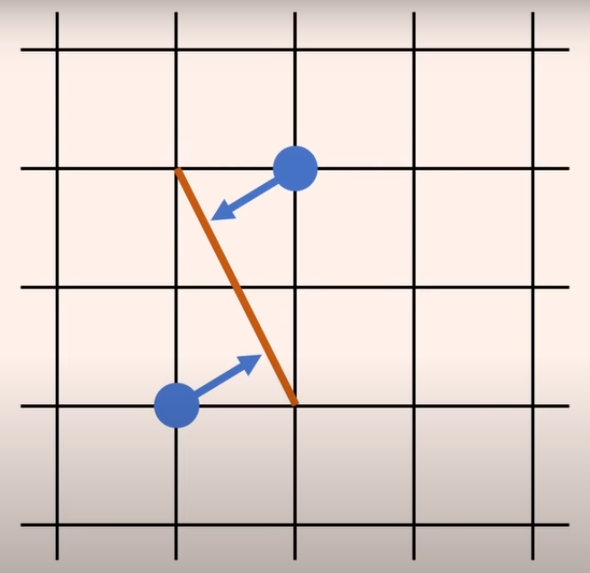

# Problem 22 : Pick's Theorem

We find this problem from SoME1([Refernce](https://www.3blue1brown.com/blog/some1-results)) competition organized by 3blue1brown this summer. The theorem goes this way- if you take a graph paper(set of grid points) with unit spaced points and draw any shape by connecting any dots on that paper then the area enclosed by the shape would be A= I+B/2-1, where I= no of points inside and B= no of points on the boudary of the shape. 

# Solution

There is an unconventional in mathematical sense yet very simple and easy to understand proof of this theorem given by 'spacematt'([Reference](https://www.youtube.com/watch?v=uh-yRNqLpOg&t=0s)). We will be discussing this proof here. 

Let's consider the bottom image: 

Now for this image there are I(=3) no of points inside the red colored shape, B(=7) no of points at the boundary of the shape. Let's consider a hypothetical situation where each point is a source of water and provides a unit of constant influx of liquid in the radial direction. At steady state the amount of water inside the shape will give the area of that shape. 

At steady state if you consider any boundary line of the shape you will see a balance of water flow from the inside and from the outside. In other words, each boundary line has a rotational symmetry with respect to the neighboring grid points. For example, in the bottom figure the flux inside and outside of that particular boudary is same i.e. there is no net water flux across the shaper boundary which means the grid points inside the shape contributes completely to the area.

Now let's consider the boundary points. The water-flow from these points have a net contribution depending on the internal angle they made inside the shape. As every point provides a unit water flux, the net influx of water to the shape will be $$\theta/2\pi$$ where $$\theta$$ is the internal angle at that point. So, the complete contribution of boundary points will be summation of each internal angles divided by $$2\pi$$. From our high school geometry we know the sum of all internal angles of any polygon is $$B\pi-2\pi$$. It is true even if we introduce some extra vertices on the sides which adds another interior angle of $$\pi$$ in the expression. This idea will support the grid points situated on the shape boundary.

So, finally the total area inside the shape will be, $$A=I+(B\pi-2\pi\/2\pi)$$ 
$$
\implies A=I+B/2-1 $$ (Hence Proved)

The proper mathematical proof is given by 'PBS Infinite Series'([Reference](https://www.youtube.com/watch?v=bYW1zOMCQno&t=538s))
