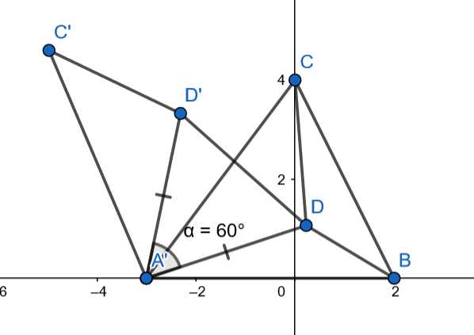
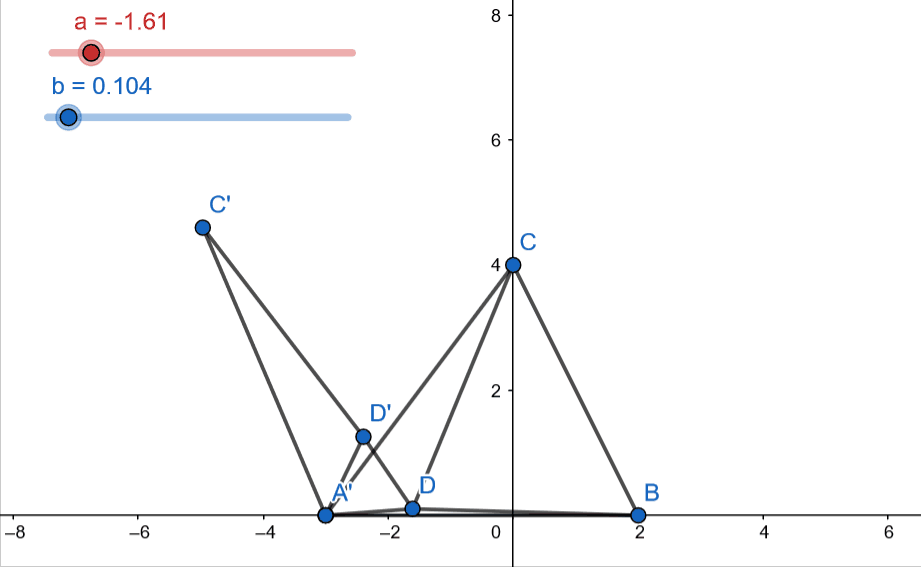

# Problem 23 : Torricelli Point of a Triangle

Over 350 years ago, P. Fermat challenged Evangelista Torricelli to find a point within a triangle such that the sum of the distances of it from the vertices of the triangle is minimized.

To this end, Torricelli went on to solve the problem in several ways and reached the conclusion that the circumcircles of the equilateral triangles built on each side of the triangle would intersect within the triangle at the Torricelli/Fermat point!

Over 350 years later, in 2021, I stumbled upon it again while going through some interesting problems on [Project Euler](https://projecteuler.net/).

One solution method uses the fact that the minimum distance between two points is the length of the straight line joining them. We will explore it here.

## Solution

The figure given above covers everything we will need to appreciate the solution to this problem. We consider a point D inside the triangle ABC and connect to each vertice A,B and C of the triangle. 

Now, we obtain the points D' and C' by rotating the triangle CAD by 60$${}^o$$ about A'. Note that labels A' and A refer to the same point A. Finally, join D and D'.

At this point one could eyeball and say that triangle ADD' is equilateral but we can prove it by noting that A'D' = A'D (by construction) and $$\angle$$ D'A'D = 60 $${}^o$$. (Isosceles triangle with apex angle = 60 degrees is equilateral)

Therefore, the sum of the distances of D (to be minimized) from the vertices of the triangle is DA + DB + DC but we just saw that DA = D'D and DC = C'D' (by construction).

Therefore, we aim to minimize C'D' + D'D + DB. We know that the shortest distance between to points is the length of the straight line joining them. Applying this for points C' and B, we can write that 

$$ C'D' + D'D + DB \geq C'B $$

The equality is achieved at minimum and that would happen when C,D',D,B all lie on the same line. Under this condition, it can be easily shown that this condition would be achieved when $$ \angle CDA' = \angle CDB = \angle ADB = 120 {}^o $$. And thus, the point has now been uniquely identified.

Let's end this with an animation (with moving interior point D) that captures a lot of things at once -- 

## Final Notes 

One could try drawing and see that this construction only works for all D's inside the triangle when all the angles of triangle are less than 120 $${}^o$$. In cases when one of the angles of the triangles is 120 $${}^o$$ or more, the point that minimizes the distance between the three vertices would overlap with the vertex associated with the largest angle.

## References

[Project Euler: Problem 143](https://projecteuler.net/problem=143)

