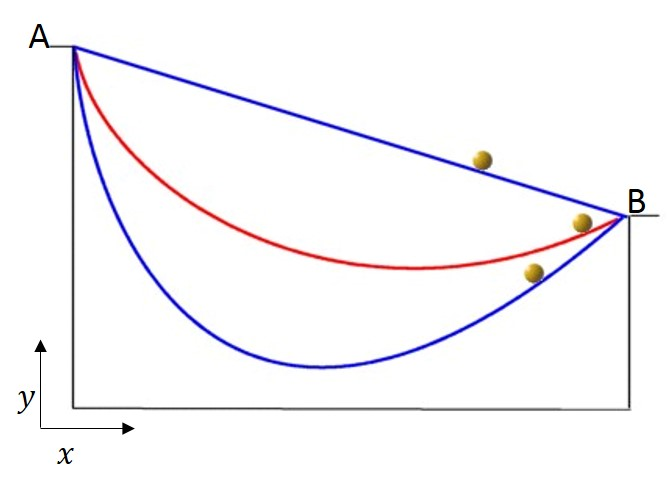
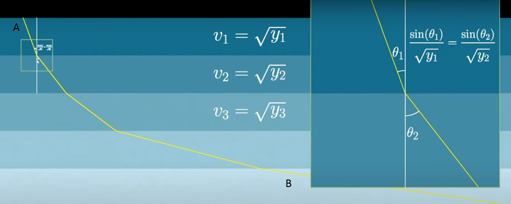

# Problem 24 : Brachistochrone Problem

Let's start this new year with a problem with substantial history from the 15th century: Brachistochrone problem. Before going into the problem statement I like to lay the historical groundwork of this problem's origin and impact on the mathematical world of that time. Johann Bernoulli, a famous swiss mathematician came up with this problem and challenged 'the most brilliant mathematicians in the world' to solve this problem and whoever would communicate Johann the solution he would 'publicly declare him worthy of praise'[1](https://mathshistory.st-andrews.ac.uk/HistTopics/Brachistochrone/). $$\\$$
The problem statement is, 'Given two points A and B in a vertical plane, what is the curve traced out by a point acted on only by gravity, which starts at A and reaches B in the shortest time.'

In the above figure there are several possible curves possible between the two points including the shortest path i.e. linear path joining the two points.

Johann received 4 responses from his brother Jacob Bernoulli, Leibniz, de L'Hospital and Newton(anonymously) along with his solution which is considered the cleaverest solution among them. We will discuss that solution here and you can check out more analytical solution in [2](https://mathworld.wolfram.com/BrachistochroneProblem.html).

# Solution

When you hear about shortest time travelled you first remember our 'everyday-friend' light. From the fundamentals of optics theory you know that light always travels through the shortest path possible between any two points residing any number of media in between them. From [Snell's law](https://oscuro-phoenix.github.io/math-for-fun/2021-06-21-Problem-16/) we know the ratio of sine of angle produced in a medium and the light velocity in that medium is constant. So, we can traslate the above problem into a optics problem where the medium property(refractive index) changes with y such that the light ray changes its path from A to B in the following figure.

Now, for a gravitional field by conserving total energy we get,
$$
mgy=1/2mv^2
\implies v=\sqrt(2gy) 
$$

From Snell's law($$sin(\theta)/v$$=constant) we get,$$\\$$
$$ sin(\theta)/\sqrt(y)$$=c(constant) valid throughout the domain. 

After simplfying we get,

$$
sin(\theta)/\sqrt(y)=c\\
\implies dx/ds=c \sqrt(y) \\
\implies dx/\sqrt(dx^2+dy^2)=c sqrt(y)\\
\implies dx^2/(dx^2+dy^2)=cy\\
\implies dx^2(1-cy)=cy(dy)^2\\
\implies 1+(dy/dx)^2=1/cy
$$

Which is nothing but the equation of a [cycloid](https://en.wikipedia.org/wiki/Cycloid). 

There is another solution for this problem by Prof. Mark Levi from University of Penn State. Check it out [here](https://4ccb06ba-5733-4d01-9652-1f173bc0e51c.filesusr.com/ugd/4d55eb_43090d54f6384c568c2f0f5e116d123f.pdf).

# Reference

1. Image Source: [3blue1brown video](https://www.youtube.com/watch?v=Cld0p3a43fU) and [Greg School](https://www.gregschool.org/lagrangian-mechanics/2017/5/18/brachistochrone-problem)