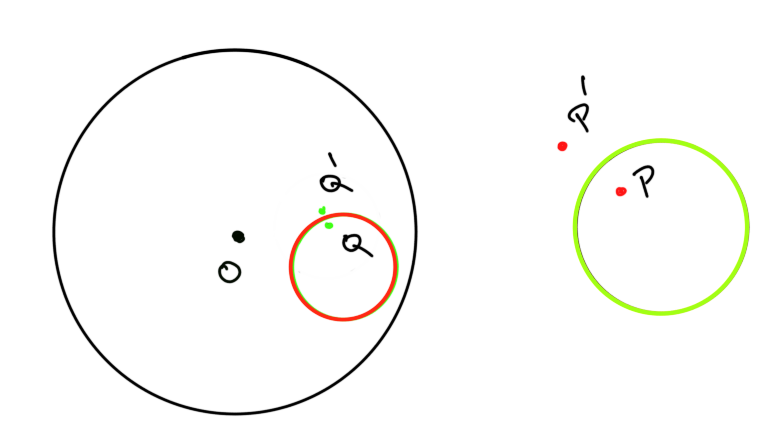
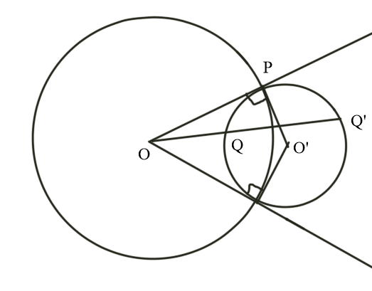
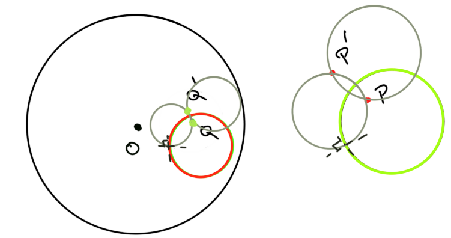

# Problem 25 : Möbius  Transformations and Symmetry

On first glance, Möbius Transformation appears to be a simple ratio of two functions that are linear in the complex variable $$z$$.

$$
\zeta = f(z) = \frac{az+b}{cz+d}
$$

where points in the $$z$$ plane are mapped to points in the $$\zeta$$ plane.

But the transformation has several interesting properties. One of these properties involves preservation of a certain symmetry that will be discussed in this post. For all the Electrical Engineering folks reading this, it is safe to assume that you may have used something similar unknowingly (Smith Chart?).

# Möbius Transformation as a combination of simple transformations

Some algebra will reveal that the expression for $$f(z)$$ can be written as 

$$
f(z) = \frac{a}{c} + \frac{bc-ad}{c^2(z+\frac{d}{c})}
$$

We can break the above expression into geometric inversion, reflection, translation, rotation and scaling (expanding/shrinking). To see why, let us start with the term in the denominator,

$$
translate(z) = z + \frac{d}{c}
$$ 

The above function simply takes any point $$z$$ on the $$z$$-plane and shifts it by $$\frac{d}{c}$$. Therefore, this step is essentially translation of the points on the $$z$$-plane.

Next, let us define $$ z_{1} = z + \frac{d}{c} $$ and $$ inv(z_1) = \frac{1}{z_1}$$. The function $$\inv(z)$$ is a complex inversion of the complex argument $$z$$. Using a polar representation of $$z = r \exp(i\theta)$$, we can easily see this as -
$$
inv(z) = \frac{1}{r}\exp(-i\theta) 
$$

The $$\frac{1}{r}$$ part corresponds to geometric inversion (more details later) and note that the angle now is the same in magnitude but has changes its sign indicating a reflection about the Real axis.

Finally, let us define $$z_2 = \frac{1}{z_1}$$ and $$ rotscale(z_2) = \frac{bc-ad}{c^2}z_2$$. Also, let $$\frac{bc-ad}{c^2} = r_{scale} \exp(i\theta_{rot})$$ then, $$rotscale(z)$$ is a function that involves two operations which are rotation by $$\theta_{rot}$$ and scaling by $$r_{scale}$$. 

With this, we conclude that the Möbius Transformation is a composition of 5 simple transformations -- Scaling, Rotation, Reflection, Geometric Inversion and Translation. Also, this points to the fact that the Möbius mapping will be conformal as long as $$ad-bc \neq 0$$ (Why?).

## Geometric Inversion

Geometric Inverse of a point in this post is focused on the geometric inverse of a point within/outside a unit circle but it can be defined with respect to any arbitrary circle. 

For simplicity let us assume that the unit circle is centered at origin O then the geometric inverse of a point P within the circle will be a point on the ray connecting the point and the center (ray OP). Let us say that the point P is at a distance of $$a$$ from the circle and the inverse point P' is at a distance of $$b$$ then the point P' is an inverse of P if $$ab = radius^2 = 1$$.

Also, in the special case when the point P coincides with the center O, the inverse of P would lie at infinity. 

# Points that are symmetric to each other in $$z$$-plane will remain symmetric in the $$\zeta$$-plane

Symmetric points are geometric inverses of each other with respect to the unit circle. To show that Möbius Transform preserves "inversion" symmetry we consider a system of 3 circles and 4 points as shown in the Figure below.

Let points P and P' be inverses of each other with respect to the circle on the right and points Q and Q' be the inverses of points P and P' with respect to the bigger unit circle. The small circle inside the unit circle is the inverse of the small circle outside. 

Now before we continue with our proof, I would first like to show that circles that are orthogonal to the unit circle (cut the unit circle normally) will remain unchanged after inversion. To show this, we can use the well-known Power of a Point Theorem to the figure given below.

Using the Power of a Point Theorem we can say that - $$ OP^2 $$ = OQ.OQ' but $$OP = 1$$ since it is equal to the radius. This implies that Q and Q' are inverses of each other! Since the choice of point Q is arbitrary, this would hold for every point on the orthogonal circle. Therefore, orthogonal circles remain unchanged under inversion. Also, this points to the fact that two orthogonal circles would intersect at points that are inverses of each other. Finally, using Similarity of triangles one can also show that any circle that passes through two points that are inverses of each other is orthogonal to the unit circle.

Using the facts above makes the proof much easier after some construction as shown in the Figure above. We can draw circles (grey) orthogonal to the green circle on the right such that they intersect at the points P and P'. Since inversion preserves the angles between the curves, the inverse of the green circle i.e. the red circle would still remain orthogonal to the grey circles inside the unit circle. Finally, using the fact derived earlier we know that the two points of intersection Q and Q' of the grey circles inside the unit circle have to be inverses of each other with respect to the red circle. This completes the proof.
