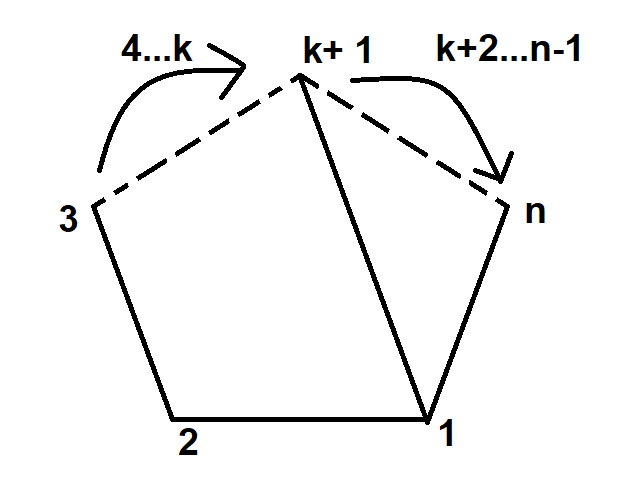

# Problem 26 : Number of Triangulations of an n-gon

This is a problem that is likely to resonate with everyone who ever sat for an aptitude test. I remember trying hard to keep track of all the triangles in a pentagon to find the number of triangulations. Well, there is a pretty general way of dealing with this! We can develop a simple reccurence solution for the same. 

Let us start by drawing out a random n-sided polygon with numbered vertices a random diagonal.
<figure>

    <figcaption>A random n-gon where dotted lines indicate that there are other vertices that have been skipped</figcaption>
    

</figure>
# Developing the recurrence

The diagonal splits the entire n-sided polygon into two sub-polygons - k+1 and n-k sided polygons. Let us denote the number of triangulations of an n-sided polygon as $$ t_n $$. Then, we know that the number of triangulations of the k+1 sided sub-polygon and the n-k sided sub-polygon will contribute to the total number of triangulations of the n-sided polygon. This leads us one step closer to a recurrence that will definitely contain the term $$ t_{k+1}.t_{n-k} $$. Note that we took a product of the two so that we can make sure we count all possible combinations of the triangulations. 

# Recurrence Relation

What do you do with that $$ k $$ there ? Naturally, we want all possible triangulations so we would simply sum over all valid k. In other words, the following equation holds

$$
t_n = \sum_{k=1}^{k=n} t_{k+1}.t_{n-k} 
$$
with $$ t_1 = 0, t_2 = 1, t_3 = 1$$. $$ t_2$$ was defined for the sake of setting up the recurrence properly. One can imagine joining the an open two sided angle to form a triangle.

Let us define a function -

$$
f(x) = \sum_1^{\infty} t_n x^n 
$$

Then,

$$
f(x) = x^2 + \sum_3^{\infty} t_n x^n = x^2 + \frac{1}{x}\sum_{n=3}^{\infty} \left(\sum_{k=1}^{n} t_{k+1}.t_{n-k} \right) x^{n+1}
$$

$$
\implies x.f(x) = x^3 + \sum_{n=3}^{\infty} \left(\sum_{k=1}^{n} t_{k+1}.t_{n-k} \right) x^{n-k}.x^{k+1}
$$

Since $$ t_1 = 0, t_2 = 1$$ we can write,
$$
\implies x.f(x) = x^3 + \sum_{n=1}^{\infty} \left(\sum_{k=1}^{n} t_{k+1}.t_{n-k} \right) x^{n-k}.x^{k+1}
$$

Now, the second term on the RHS is essentially accounting for all the terms in the product of $$ f(x)$$ with itself! 

So, we can write,
$$
\implies x.f(x) = x^3 + f(x)^2
$$
Using the quadratic formula to solve for $$ f(x)$$ we get,
$$
\implies f(x) = x\frac{1-\sqrt{1-4x}}{2}
$$

Reminder : By definition, the coefficients in the expansion of $$ f(x)$$ represent the series of $$ {t_n} $$. So, we're basically done!

# Binomial Expansion 

The binomial expansion of $$\sqrt{1-4x}$$ is given by,

$$
 \sqrt{1-4x} = 1 + \sum_{p = 1}^{\infty}\frac{(-1)^{p-1}}{p.2^{2p-1}}{2p-2 \choose p-1}(-4x)^p
$$
$$
\implies \sqrt{1-4x} = 1 - \sum_{p = 1}^{\infty}\frac{2}{p}{2p-2 \choose p-1}.x^p
$$

# Finding $$ t_p $$ 

Using the Binomial Expansion in the expression for $$ f(x)$$ gives us,

$$
f(x) = \frac{1}{p}{2p-2 \choose p-1}x^{p+1}
$$

So, we have our answer !

$$
t_p = \frac{1}{p-1}{2p-4 \choose p-2}
$$
# Continuous Graph of the function
<iframe src="https://www.desmos.com/calculator/mteco4mvo7?embed" width="500" height="500" style="border: 1px solid #ccc" frameborder=0></iframe>

### This completes the solution.
