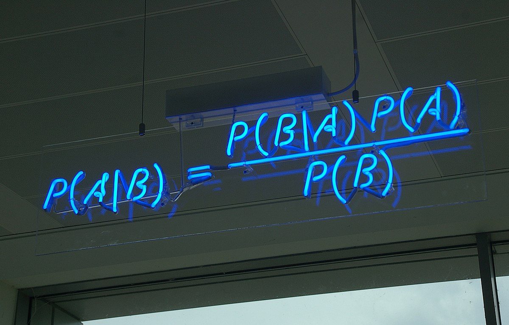

# Problem 28 : Bayesian Information Criterion

<figure>

    <figcaption>Bayes' theorem spelt out in blue neon at the offices of Autonomy in Cambridge  <a href="https://commons.wikimedia.org/wiki/File:Bayes%27_Theorem_MMB_01.jpg">[Source]</a> </figcaption>
    

</figure>

There's a saying among people who work in theory and modeling -- "All models are wrong but some are useful". I still remember this one day from my pre-final year in undergrad when I was walking back to dorm after a long night during the cultural fest (SF) at IIT-KGP. How do we justify usage of one model over the other? For example, there are several turbulence models -- (one-parameter Prandtl mixing length model, two-parameter $$ \kappa-\varepsilon$$,...) that go into the Reynolds Averaged Navier Stokes (RANS) equations. Instinctively, I had this feeling that the model closer to the "truth" would be the simplest one (least parameters) that could reasonably capture the physics/experimental data. But, I was unsure if this notion of "truth" was true. I already had seen Bayesian and Akaike Information Criteria (BIC,AIC) in my 7th semester "Regression and Time Series Modeling" class and realized that we might have to live with this uncertainty given that the so-called model selection criteria are just heuristics. 
 
When it comes to model selection, the Bayesian Information Criterion (BIC) is often used. I'll go over the derivation of BIC in this blog post.

#  Set-up

We want to find the model $$ M_i $$ that best explains the data $${y_j}$$. The probability of a model given the data in accordance with the Bayes theorem is given by,

$$
P\left(M_i \mid y_1, \ldots, y_n\right)=\frac{P\left(y_1, \ldots, y_n \mid M_i\right) P\left(M_i\right)}{P\left(y_1, \ldots, y_n\right)}
$$

Assuming that all the models are equally likely, the equality implies that maximizing the LHS is the same as maximizing $$P\left(y_1, \ldots, y_n \mid M_i\right) P\left(M_i\right)$$ which is nothing but the marginal likelihood of the data given the $$i^{th}$$ model.

This is where things become interesting. The likelihood function essentially represents the joint probability of observing the dataset $$ {y_j}$$ given the parameters $${\theta_i}$$ in the $$i^{th}$$ model. But the functional form of likelihood is in fact going to involve parameters that capture the probability of observing each data point $$ y_j $$. The overall likelihood would then be given by the product of likelihoods of individual data points (assuming independence for simplicity). For example, if we have a series of data points $${y_j}$$ that we propose are normally distributed with two parameters having mean $$\mu$$ and standard deviation $$\sigma$$, we can define the likelihood to be the product of the probability of each $$ y_j$$ given $$\mu$$ and $$\sigma$$.

Let us denote the likehood function for the $$i^{th}$$ model $$M_i$$ as $$ f(\mathbf{y} \mid \mathbf{\theta}_i)$$ (boldfaced letters represent vectors) and if we have some prior information about the parameters we can include a prior distribution $$ g(\mathbf{\theta})$$. Then the "best" model would be the one that maximizes,

$$
P\left(\mathbf{y} \mid M_i\right)=\int f\left(\mathbf{y} \mid \boldsymbol{\theta}_i\right) g_i\left(\boldsymbol{\theta}_i\right) d \boldsymbol{\theta}_i=\int \exp \left(\log \left(f\left(\mathbf{y} \mid \boldsymbol{\theta}_i\right) g_i\left(\boldsymbol{\theta}_i\right)\right)\right) d \boldsymbol{\theta}_i
$$

# Derivation 

Let us now assume the log likelihood function is sharply peaked at the maximum likelihood estimator (MLE) i.e. the stationary point in the parameter space at which the likelihood is maximum. This will allow us to use Laplace's method (see below) of approximating an integral, a classic trick for sharply peaked functions. 

Using a second order expansion for $$ \log \left(f\left(\mathbf{y} \mid \boldsymbol{\theta}_i\right) g_i\left(\boldsymbol{\theta}_i\right)\right) = log(fg_i)_{MLE} + \frac{1}{2}
\left(\boldsymbol{\theta}_i-\boldsymbol{\theta}_{i,MLE}\right)^T H_{\theta_{i,MLE}}\left(\boldsymbol{\theta}_i-\boldsymbol{\theta}_{i,MLE}\right) $$ where $$H$$ is the hessian matrix we get,

$$
\begin{aligned}
P\left(\mathbf{y} \mid M_i\right) & \approx \exp \left(log(fg_i)\vert_{\theta_{\boldsymbol{i},MLE}}\right) \int \exp \left[\frac{1}{2} P^T \tilde{H}_{\boldsymbol{\theta}_{i,MLE}} P\right] d P
\end{aligned}
$$

where $$ P = (\mathbf{\theta} - \mathbf{\theta}_{i,MLE})$$.

Assuming that $$H$$ admits an eigenvalue decomposition of the form $$ H = -S^T \Lambda S$$, we can substitute $$ X = SP $$ in the above expression to get,

$$
\begin{aligned}
P\left(\mathbf{y} \mid M_i\right) & \approx \exp \left(\left.log(fg_i)\right|_{\theta_{\boldsymbol{i},MLE}}\right) \int \exp \left\{-\frac{1}{2} X^T \Lambda X\right\} d X
\end{aligned}
$$

Assuming that the $$exp$$ function decays rapidly as it goes away from $$ X= P = 0$$, we can set the limits to be $$-\infty$$ to $$+\infty$$ to obtain,

$$
\begin{aligned}
P\left(\mathbf{y} \mid M_i\right) & \approx (f.g_i)\vert_{\theta_{\boldsymbol{i},MLE}} \int_{-\infty}^{+\infty} \exp \left\{-\frac{1}{2} \sum_{i=1}^{N_p} \lambda_j X_j^2 \right\} d X
\end{aligned}
$$

where $$ N_p $$ is the number of parameters and $$\lambda_j$$ is the $$j^{th}$$ eigenvalue. Using the fact that $$\Gamma(\frac{1}{2}) = \sqrt{\pi}$$ (Many proofs exist), the integral above can be evaluated to be,

$$
\begin{aligned}
P\left(\mathbf{y} \mid M_i\right) & \approx f\left(y \mid \tilde{\boldsymbol{\theta}}_i\right) g_i\left(\tilde{\boldsymbol{\theta}}_i\right) \frac{(2 \pi)^{N_p/2}}{\left|H_{\boldsymbol{\theta}_i}\right|^{1 / 2}}
\end{aligned}
$$

To simplify things further we'll have to look at the definition of the Hessian $$ H $$ of the $$ \log \left(f\left(\mathbf{y} \mid \boldsymbol{\theta}_i\right) g_i\left(\boldsymbol{\theta}_i\right)\right) = \log(L)$$. For brevity, we will represent the function as $$ \log(L) = \log\left(\Pi_{j=1}^{n} L_j \right) = \sum_{j=1}^{n} log(L_j)$$ where the sum is over all $$y_j$$ for $$j = 1,\ldots,n$$ independent data points. 

Each element of the Hessian is then given by,

$$
H_{lk} =-\left.\frac{\partial^2 \sum_{j=1}^n \log L_j}{\partial \theta_l \partial \theta_k}\right|_{\boldsymbol{\theta}_{\boldsymbol{i}}=\boldsymbol{\theta}_{i,MLE}} = -n\left.\frac{\partial^2 \frac{1}{n} \sum_{j=1}^n \log L_j}{\partial \theta_l \partial \theta_k}\right|_{\boldsymbol{\theta}_{\boldsymbol{i}}=\boldsymbol{\theta}_{i,MLE}}
$$

Functions of random numbers are random. So, $$L_j$$'s that represent the likelihood evaluated at the $$j^{th}$$ output $$y_j$$ are random values assuming that $$y_j$$'s follow an underlying distribution. For a large number of data points $$ n $$ we can invoke the Law of Large Numbers (LLN) (see [Wikipedia](https://en.wikipedia.org/wiki/Law_of_large_numbers)) to say that, 

$$  \frac{1}{n} \sum_{j=1}^n \log L_j \stackrel{P}{\rightarrow} \mu $$ where $$\mu$$ is the expected value or mean of $$L_j$$.

The key takeaway from the last equation is that we can now write the Hessian $$H_{lk}$$ as, $$ H_{lk} = n.\mathcal{I}_{lk}$$ where $$I_{lk}$$ actually has a [name](https://en.wikipedia.org/wiki/Optimal_design). $$I_{lk}$$ are the entries of the Fisher information matrix. In essence, $$I$$ captures the amount of information about the parameters (here, "information" is "high" when the magnitude of the variation of the log likelihood is large w.r.t to the parameters). This idea is relevant in design of experiments wherein the "parts" of the "design-space" where the "information" is high is preferentially explored.

To close the problem, we note that the final expression for $$P\left(\mathbf{y} \mid M_i\right)$$ had the determinant of $$H$$, $$\|H\|$$ in the denominator (Pardon my abuse of notation - norm (\|\|.\|\|), abs(\|.\|) and det() of a matrix have the same meaning here). This can now we replaced by the determinant of $$\mathcal{I}.n$$ that is $$n^{N_p}\|\mathcal{I}\|$$. 

Finally, we take the log of both sides of the expression for  $$P\left(\mathbf{y} \mid M_i\right)$$ and substitute $$\left\|H_{\boldsymbol{\theta}_i}\right\| = n^{N_p}\|\mathcal{I}\|$$ to get,

$$ \log P\left(\mathbf{y} \mid M_i\right) \approx log(L) + \frac{N_p}{2}\log (2\pi) - \frac{N_p}{2} log(n) - \frac{1}{2}log\|\mathcal{I}\| $$

For large n, neglecting terms, the expression can be further simplified to obtain the famous BIC criterion that tries to maximize,

$$
\log P\left(\mathbf{y} \mid M_i\right) = log(L) - \frac{N_p}{2}log(n)
$$
 
## Laplace's Method

The integral approximation is simple to derive. Assuming that $$f(x)$$ is twice differentiable near $$ x_0 $$ at which it is maximum, the Taylor expansion of $$f(x)$$ up to the second derivative term can be used and integrated over a bounds $$[a,b]$$ that include $$ x_0 $$ to obtain the following result,

$$
\int_a^b e^{M f(x)} d x \approx \sqrt{\frac{2 \pi}{M\left|f^{\prime \prime}\left(x_0\right)\right|}} e^{M f\left(x_0\right)}
$$

for large M. [See more](https://en.wikipedia.org/wiki/Laplace's_method).