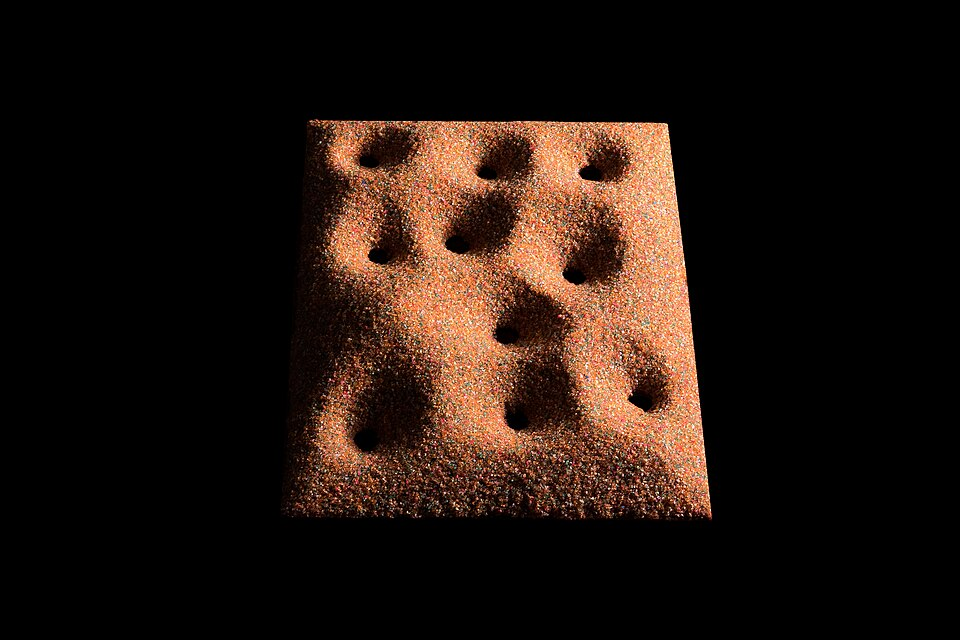
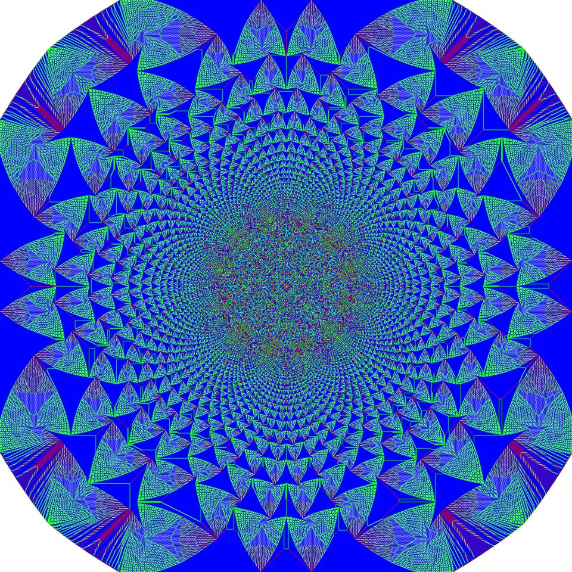
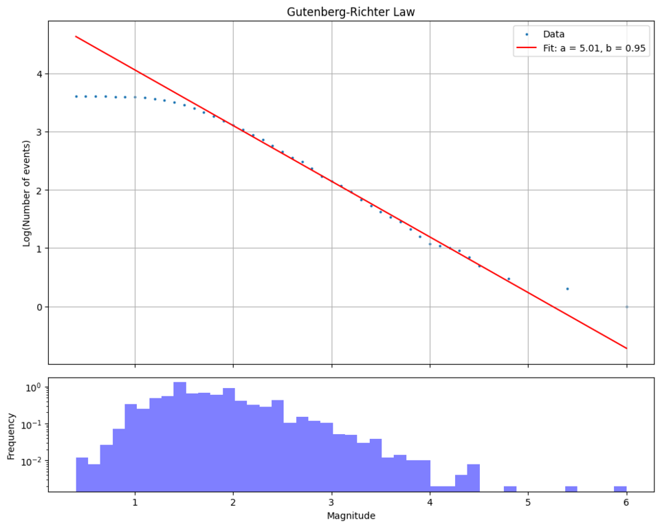
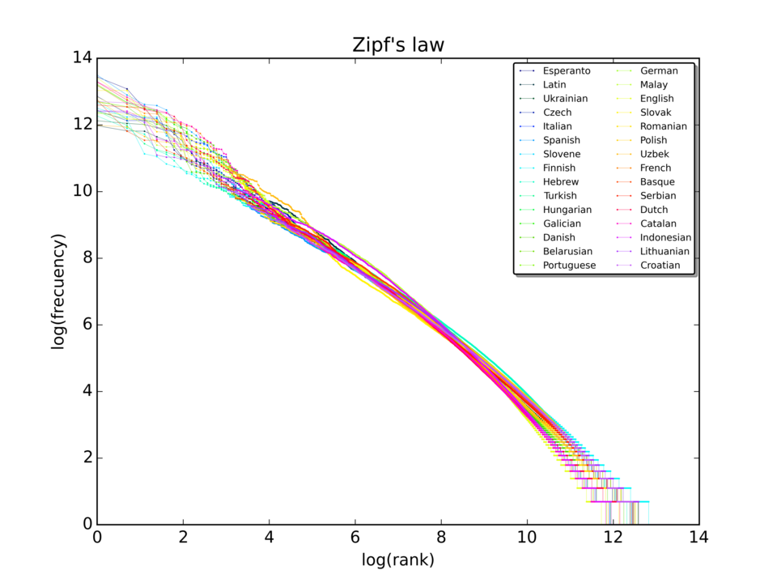

# Problem 33 : Why (I think) does Nature love power laws?

This is something that has been on my mind for a while now. Some time during the second year of my PhD at MIT, I was staring at impedance plots of battery electrodes and kept seeing a stubborn shape -- a depressed semicircle in the Nyquist plane that no honest RC circuit could fit. The community's polite workaround is to throw in a "Constant Phase Element" with impedance $$ Z_{CPE} = Q^{-1}(j\omega)^{-\alpha} $$ for some fractional $$ \alpha $$ between 0 and 1 and move on. What started bothering me was that the same little exponent kept showing up in places that had nothing to do with each other -- supercapacitors, cracked solids, brain signals, glasses relaxing toward equilibrium. And not just there -- we see power laws in city sizes, stock returns, earthquakes, even the weight matrices of GPTs. There clearly was something more general going on.

In this post, I want to give a "feel" for one of the cleanest mechanisms by which Nature manufactures power laws -- the **sandpile model** of Bak, Tang, and Wiesenfeld (BTW). It's a beautifully simple cellular automaton that, with no parameter tuning whatsoever, settles into a state where the size of avalanches follows a power law. After we get comfortable with it, I'll try to connect this back to the maximum-entropy story (which I think is the closest we have to a "why" for the shape itself), and then we'll look at a few places in the wild where this same kind of power law appears. Let's jump right in...

# A pile of sand

Let us start with a picture in mind. Imagine an empty table on which we are dropping grains of sand, one at a time, very slowly. At first, nothing interesting happens -- a small pile starts forming. But as the pile grows taller, the local slopes get steeper, and eventually a single new grain triggers a small landslide. Sometimes the landslide is tiny, just a few grains shuffling around. Sometimes it's enormous, cascading across the entire pile in a way that feels totally disproportionate to the one grain we just added.

Real sand also has a built-in "critical slope" called the angle of repose. Pile it any steeper and it slides; pile it any shallower and you can keep adding grains. Hold on to this idea of a critical slope -- it'll be the whole story in a moment.

<figure>

        <figcaption> Sand drained through a few holes settles into craters with the same slope everywhere -- the angle of repose. Sand "knows" its critical slope. (Photo: Rodrigo Tetsuo Argenton, object at Matemateca IME/USP, <a href="https://commons.wikimedia.org/wiki/File:Sandpile_Matemateca_19.jpg">CC BY-SA 4.0</a>) </figcaption>
    

</figure>

Bak, Tang and Wiesenfeld in their famous [1987 paper](https://doi.org/10.1103/PhysRevLett.59.381) had the elegant idea of replacing this physical sandpile with a cellular automaton that captures the same essential dynamics. The rules are almost embarrassingly simple. Consider a 2D grid where each site $$ (i,j) $$ stores an integer $$ z_{i,j} \geq 0 $$ which we can think of as the local "slope" or pile height. The rules are,

1. **Drive (drop a grain).** At each time step, pick a random site and increment its value by 1: $$z_{i,j} \to z_{i,j} + 1$$.

2. **Topple.** If at any site we have $$z_{i,j} \geq z_c$$ (where $$z_c = 4$$ for the standard 2D model), then the site becomes unstable and topples,

   $$
   \begin{equation}
   z_{i,j} \to z_{i,j} - 4, \quad z_{i\pm 1,j} \to z_{i\pm 1,j} + 1, \quad z_{i,j\pm 1} \to z_{i,j \pm 1} + 1
   \end{equation}
   $$

   i.e. the toppling site loses 4 grains and donates 1 to each of its 4 nearest neighbours.

3. **Cascade.** A toppling can push a neighbour over the threshold, which topples in turn, which pushes its own neighbours over, and so on. We let this cascade play out fully (treating the boundaries as "off the table" -- grains that reach the edge simply disappear) before dropping the next grain.

That's it. There are no parameters to tune. There is no temperature, no critical point hidden somewhere that we have to dial into. And yet if we sit back and watch, what we observe is remarkable. Even if you cheat and drop all the grains on a single site, the rules alone produce something like this,

<figure>

        <figcaption> 28 million grains dropped on the central site of a BTW sandpile and left to topple. Colors denote the number of grains (0 to 3) left at each site. Nobody designed this pattern -- it is just rule 2 applied over and over. (Image: Claudio Rocchini, <a href="https://commons.wikimedia.org/wiki/File:Backtang2.png">CC BY 3.0</a>) </figcaption>
    

</figure>

# Why it produces a power law (the feel)

Let me try to give the feel before getting any more technical. Two competing things are happening at the same time,

- **Slow drive.** We are pumping sand into the system, one grain at a time.
- **Fast dissipation in bursts.** The only way sand can leave is by falling off the edge of the table, and that happens through avalanches.

Let us do some simple bookkeeping. Every time step adds exactly 1 grain to the pile. In the long run, the pile can only stop growing if, on average, exactly 1 grain leaves per time step. Now think about what that requires.

Initially, the pile is mostly flat and avalanches are small and local. They die out somewhere in the middle of the table, so no grain ever reaches the edge. Nothing leaves, the pile keeps growing, and as it grows each toppling is more likely to push its neighbours over the threshold. So the avalanches travel farther. On the other hand, if avalanches were so large that they reached the edge all the time, more than 1 grain would leave per time step, the pile would shrink, and the avalanches would get smaller again.

So, the pile can only settle down at one place -- where avalanches reach the edge just often enough for the outflow to match the inflow. Note that this means typical avalanches can be as large as the table itself. Equivalently, the correlation length of the avalanches is only limited by the size of the table, and the pile is *critical*. A single new grain can trigger anything from one grain shuffling to a system-spanning cascade. This is what Bak called **self-organized criticality**: the system tunes *itself* to the critical point, no external knob required.

## A Family Tree of Topplings

Now, why does this give a power law? Let us do this properly, at least for the simplest (mean-field) version of the model. Think of an avalanche as a family tree of topplings -- the original grain causes some topplings, each of those topples its own neighbours, and so on. Say each toppling triggers $$k$$ new ones, where $$k$$ is random with probabilities $$p_k$$, mean $$m$$ (the branching ratio) and variance $$\sigma^2$$. The size $$S$$ of the avalanche is the total number of topplings in the tree. Let us define the generating functions of the avalanche size and of the number of children,

$$
G(x) = \sum_{s} P(S = s)\, x^s, \qquad f(y) = \sum_k p_k\, y^k
$$

The first toppling counts as 1, and each of its $$k$$ children starts an independent avalanche of the same kind. So $$S = 1 + S_1 + \dots + S_k$$, and since generating functions turn sums of independent variables into products, we get a self-consistency equation,

$$
\begin{equation}
G(x) = x\, f\big(G(x)\big)
\end{equation}
$$

Our bookkeeping argument told us that the pile sits at $$m = 1$$ (on average, one toppling leads to one more). Let us look at what the equation says near $$x = 1$$. Put $$x = 1-\epsilon$$ and $$G = 1 - u$$ with $$u, \epsilon$$ small and positive. Expanding $$f$$ around 1 and using $$f(1) = 1$$, $$f'(1) = m = 1$$ and $$f''(1) = \sigma^2$$ (this is where $$m = 1$$ is used),

$$
f(1-u) = 1 - u + \tfrac{\sigma^2}{2}u^2 + \dots
$$

Then the left side of the equation is $$1-u$$ and the right side is $$(1-\epsilon)\left(1 - u + \tfrac{\sigma^2}{2}u^2 + \dots\right) = 1 - u + \tfrac{\sigma^2}{2}u^2 - \epsilon + \dots$$, where the terms we dropped are smaller. The $$1$$ and the $$-u$$ cancel on both sides, leaving $$\tfrac{\sigma^2}{2}u^2 \approx \epsilon$$. Solving for $$u$$ gives,

$$
\begin{equation}
G(x) \approx 1 - \frac{\sqrt{2}}{\sigma}\,(1-x)^{1/2}
\end{equation}
$$

The generating function has a square-root singularity at $$x=1$$. The coefficients of $$(1-x)^{1/2}$$ are $$\Gamma(s-\tfrac12)/\big(\Gamma(-\tfrac12)\,\Gamma(s+1)\big) \approx -s^{-3/2}/(2\sqrt{\pi})$$, so reading off the coefficient of $$x^s$$ gives,

$$
\begin{equation}
P(S = s) \approx \frac{1}{\sigma\sqrt{2\pi}}\; s^{-3/2}
\end{equation}
$$

and we are done! This is a power law with $$\tau = 3/2$$. (Turning a singularity into the large-$$s$$ behaviour of the coefficients is a standard "transfer theorem". It needs a finite variance $$\sigma^2$$ and that $$x=1$$ is the singularity closest to the origin.)

What happens if we are not at $$m = 1$$? Redoing the expansion with $$m < 1$$ gives $$(1-m)\,u \approx \epsilon$$, so $$G$$ is perfectly smooth at $$x=1$$ and avalanche sizes die off exponentially -- there is a typical size. The square root, and with it the power law, only appears at exactly $$m = 1$$, which is the value the pile pins itself to.

On the actual 2D grid, neighbouring topplings are correlated and numerical estimates of $$\tau$$ land around 1.2 to 1.3 (the precise value has been surprisingly hard to pin down). But the shape is the same: a power law, cut off only by the size of the table.

What makes this whole story so satisfying is that the BTW model needs nothing -- no temperature, no carefully chosen coupling, no fine-tuning. The *driving itself* manufactures the criticality. That's the punchline of self-organized criticality, and once you've seen it once, you start suspecting that a lot of natural systems -- which after all are also being slowly driven and occasionally relaxing in bursts -- might be sitting in this kind of self-organised state without anyone having put them there on purpose.

# Connecting back to maximum entropy

Now that we have a mechanistic story for *how* a power law shows up, I want to briefly connect it to *why* the shape of the steady-state distribution is $$ p(x) \propto x^{-\gamma} $$ and not something else.

Recall the standard [Jaynes (1957)](https://bayes.wustl.edu/etj/articles/theory.1.pdf) maximum-entropy program: of all distributions consistent with what we know, pick the one that maximizes

$$
S[p] = -\int p(x)\log p(x) \, dx
$$

If the only thing we know is the average $$\langle x \rangle$$, the Lagrange multiplier dance gives an exponential, $$p(x) \propto e^{-\lambda x}$$. So Jaynes by himself does **not** give a power law -- a subtlety I think is worth flagging because I almost glossed over it.

The actual move that gets you a power law was made by [Montroll and Shlesinger (1983)](https://doi.org/10.1007/BF01012708) in a paper with the wonderful title *"A tale of tails."* They pointed out that to get an inverse-power-law distribution from maximum entropy, you have to swap the linear constraint for an "unconventional auxiliary condition" -- you constrain the average of $$\log x$$ instead of the average of $$x$$. That is, you know the typical *order of magnitude* but not the typical *value*. Re-doing the optimization with $$\int (\log x)\, p(x)\, dx = \langle \log x \rangle$$ as the constraint (and a smallest allowed size $$x_{min}$$, so that the distribution can be normalized), the multiplier $$\gamma$$ enters in the right place, and the maximizer is

$$
\begin{equation}
p(x) \propto e^{-\gamma \log x} = x^{-\gamma}
\end{equation}
$$

This dovetails very nicely with the sandpile picture. For $$\tau < 2$$, the average avalanche size $$\langle s \rangle$$ doesn't settle to a fixed number at all -- it keeps growing as you make the table bigger. So the one piece of information you would naturally try to constrain is not really a property of the pile. What the pile *does* have a stable sense of is the order of magnitude on which avalanches live, between a single grain and the size of the table. That is exactly the regime in which the Montroll-Shlesinger constraint is the natural one, and the maximum-entropy distribution is, predictably, a power law.

So the two pictures fit together. The sandpile gives us a *mechanism* for arriving at a state with no preferred scale; maximum-entropy-on-$$\log x$$ tells us that, once we are in such a state, the least-biased guess for the *shape* of the distribution is $$x^{-\gamma}$$. One is the recipe; the other is the result.

# Where this shows up in the wild

Once you have the sandpile picture in mind, you start seeing it everywhere. Here are a few of the most interesting validated examples I came across,

## Earthquakes (the Gutenberg-Richter law)

The earth's crust is, with some poetic license, a giant 3D sandpile -- tectonic plates push stress in slowly, and faults release it suddenly in bursts. The famous [Gutenberg-Richter law](https://en.wikipedia.org/wiki/Gutenberg%E2%80%93Richter_law) says the number $$N$$ of earthquakes with magnitude greater than $$M$$ obeys $$ \log_{10} N = a - b M $$, with $$b \approx 1$$ in most seismically active regions. Since magnitude is itself a logarithm of energy, this is a true power law in the released energy. For every magnitude-4 quake, expect about ten magnitude-3s and a hundred magnitude-2s. There is no characteristic earthquake.

<figure>

        <figcaption> Aftershocks of the August 2016 Central Italy earthquake. The straight line on the log scale (fitted b = 0.95) is the Gutenberg-Richter law; the flattening at small magnitudes is just the detectors missing the tiniest quakes. (Image: Cosmia Nebula, data from INGV, <a href="https://commons.wikimedia.org/wiki/File:Gutenberg%E2%80%93Richter_law_in_the_2016_Central_Italy_earthquake_%28magnitude%29.png">CC BY-SA 4.0</a>) </figcaption>
    

</figure>

## Avalanches in the brain

This is the one that comes closest to a literal sandpile, and it's the "brain signals" I mentioned at the start. [Beggs and Plenz (2003)](https://doi.org/10.1523/JNEUROSCI.23-35-11167.2003) recorded activity in slices of rat cortex and found that neurons fire in cascades -- one neuron pushes its neighbours over threshold, which push theirs, and so on -- which they called *neuronal avalanches*. The sizes of these avalanches followed a power law with an exponent close to $$3/2$$, exactly the critical branching value we derived above. The branching ratio they measured was close to 1. The rules are different (neurons instead of grains, synapses instead of neighbours), but the story is the same.

## Stock market returns (the inverse cubic law)

Markets too look a bit like a sandpile -- information and orders pile up slowly and the price reacts in cascades. Empirically, if $$r$$ is the return of a liquid stock or index, the tail of the distribution obeys $$ P(\lvert r \rvert > x) \propto x^{-\alpha}$$ with $$\alpha \approx 3$$ ([Gopikrishnan, Plerou, Gabaix and Stanley](https://ideas.repec.org/p/arx/papers/cond-mat-9803374.html), using tens of millions of price changes from the major US exchanges). This is the reason crashes happen far more often than a Gaussian risk model would suggest -- a $$5\sigma$$ day in a Gaussian world is a once-in-several-thousand-years event, while under an inverse cubic tail it's something you should expect to live through more than once. Anyone who lived through 2008 or March 2020 has empirical evidence on which is closer to reality.

## Cities and words (Zipf's law)

If you rank cities by population from largest to smallest, the population of the $$n$$-th largest scales roughly like $$ \text{population}(n) \propto n^{-1} $$. This is Zipf's law, and the same exponent of $$\sim 1$$ shows up for the frequency of words in natural language, the size of firms, and the number of citations to academic papers. (To be fair, it is not perfect -- a [73-country study](https://doi.org/10.1016/j.regsciurbeco.2004.04.004) found it fails more often than it should when you look one country at a time.) The mechanism here is closer to a multiplicative random walk than a literal sandpile: if every city grows by a random *percentage* each year, independent of its size, then $$\log(\text{population})$$ does a random walk, and [Gabaix (1999)](https://doi.org/10.1162/003355399556133) showed that this, plus a lower barrier, gives Zipf's law. Notice that the natural variable is again $$\log x$$ -- the Montroll-Shlesinger regime.

<figure>

        <figcaption> Rank vs. frequency of the first 10 million words in 30 different Wikipedias, on log-log axes. Thirty languages, one straight line. (Image: SergioJimenez, <a href="https://commons.wikimedia.org/wiki/File:Zipf_30wiki_en_labels.png">CC BY-SA 4.0</a>) </figcaption>
    

</figure>

## Neural network weights

This one is probably my favourite because it sits right in the middle of modern AI. If you take a single weight matrix $$W$$ from inside a trained deep neural network, compute the eigenvalues $$\lambda$$ of $$W^T W$$, and plot the histogram, you find a heavy-tailed distribution well fit by $$ p(\lambda) \propto \lambda^{-\mu}$$. A randomly initialized network shows no such tail. This is the [heavy-tailed self-regularization](https://jmlr.org/papers/volume22/20-410/20-410.pdf) story of Martin and Mahoney, and the part that genuinely surprised me came [later](https://doi.org/10.1038/s41467-021-24025-8): metrics built from $$\mu$$ track the quality of hundreds of pretrained models (VGG, ResNet, GPT-style language models) without ever looking at training or test data. Smaller $$\mu$$, heavier tail, better-trained layer. Why training does this is still an open question; my own hunch is the sandpile-ish one -- training is a long, slow drive where updates compound multiplicatively through chains of matrices, and there is no preferred scale for "how much a direction should matter."

# Wrapping it up

What I find genuinely amazing is how often this same little story plays out across completely unrelated domains. Slow driving, occasional bursts of dissipation, no preferred scale -- and out pops $$ p(x) \propto x^{-\gamma} $$. The sandpile is the cleanest cartoon I know for this, and the Montroll-Shlesinger maximum-entropy argument is the cleanest justification I know for the shape that the cartoon produces.

It almost feels like Nature has a default font, and that font is the power law. Whenever a system loses its sense of "typical" -- because it's being slowly driven, or because everything compounds multiplicatively, or simply because no scale is preferred -- the universe shrugs and writes things in this font. Earthquakes, neurons, crashes, cities, GPTs, and (the part that started this whole rant for me) the depressed semicircles I keep seeing in battery impedance plots all turn out to be different sentences in the same handwriting.

P.S. -- The maximum-entropy story tells you *when* to expect a power law, not *what the exponent will be*. Pinning down $$\gamma$$ (or $$b$$, or $$\alpha$$, or $$\mu$$, or $$\tau$$) requires the actual physics of the system -- the geometry of the lattice for the sandpile, the order book for stocks, the loss landscape for neural nets. The "feel" gives you the shape; the physics gives you the slope.

P.P.S. -- The battery story I alluded to at the top is what I've been working on with my advisor at MIT for the past while. It turns out that the depressed semicircle in battery impedance is the macroscopic shadow of a broad spectrum of inter-particle relaxation timescales, set by the graph Laplacian of the heterogeneous wiring network inside the electrode. Same broad-spectrum, no-preferred-scale story as the examples above, just played out in lithium and carbon black instead of dollars or words. Hopefully a separate post on that one soon.
